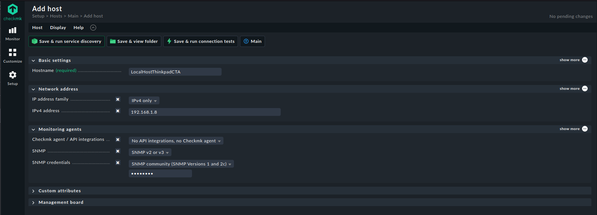
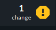
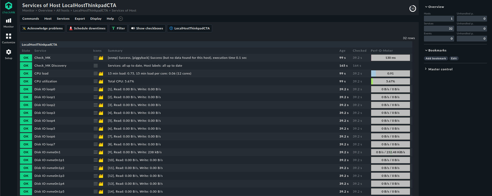
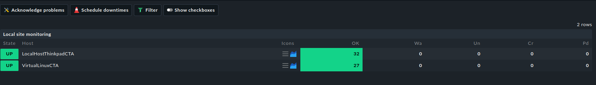

## Future Tasks
- Set a static IP address for consistent network access.

# Installing Checkmk

In this guide, we'll be using the Checkmk Raw version. You can download it from the following link: [Checkmk Raw Version Download](https://checkmk.com/download?method=cmk&edition=cre&version=2.3.0&platform=ubuntu&os=jammy&type=cmk&google_analytics_user_id=)

The Free version of Checkmk is the Enterprise edition with all features, but it limits the number of services you can monitor (only 25 hosts and 750 services). The Raw version is the community edition with fewer features, but it allows unlimited monitoring services and is open source.


**1. Download  and install the Checkmk package:**

```bash
wget https://download.checkmk.com/checkmk/2.3.0/check-mk-raw-2.3.0_0.jammy_amd64.deb

sudo apt install ./check-mk-raw-2.3.0_0.jammy_amd64.deb
```

**2. Creating a Checkmk Monitoring Site**

We'll use the `omd` command to create a new Checkmk site. You can choose your own name for the site. In this example, we'll name the site `monitoring`.

```bash
sudo omd create monitoring
```

After running the command, you'll see output similar to the following:

```bash
sudo omd create monitoring                    
Adding /opt/omd/sites/monitoring/tmp to /etc/fstab.
Creating temporary filesystem /omd/sites/monitoring/tmp...OK
Updating core configuration...
Generating configuration for core (type nagios)...
Precompiling host checks...OK
Executing post-create script "01_create-sample-config.py"...OK
Executing post-create script "02_cmk-compute-api-spec"...OK
Restarting Apache...OK
Created new site monitoring with version 2.3.0.cre.

  The site can be started with omd start monitoring.
  The default web UI is available at http://ThinkPad-CTA/monitoring/

  The admin user for the web applications is cmkadmin with password: 35u******
  For command line administration of the site, log in with 'omd su monitoring'.
  After logging in, you can change the password for cmkadmin with 'cmk-passwd cmkadmin'.
```

*Take note of the URL, default username, and the automatically generated password for accessing the site. Make sure to change or remember this password, as it won't be displayed again.*

The site is now created, but it still needs to be started. To start the site, use the following command:

```bash
sudo omd start monitoring
```

Once everything starts successfully, you'll see an output similar to the following:

```bash
Temporary filesystem already mounted
Starting agent-receiver...OK
Starting mkeventd...OK
Starting rrdcached...OK
Starting npcd...OK
Starting nagios...OK
Starting apache...OK
Starting redis...OK
Initializing Crontab...OK
```

*In case you want to delete this ```monitoring``` to create a new one:*
```bash
sudo omd stop monitoring
sudo omd rm monitoring
```

Now, open the provided URL and set up a new host:

Navigate to `Setups > Hosts > Add host to the monitoring`.



Click `Change`, then `Accept all changes` in the top right corner:



Wait a few minutes for all services to be added, then go to `Monitors > All hosts`:

Choose your host:



You can also test this on a Virtual Machine, both should work:




## References:
- [Checkmk Tutorial Video](https://youtu.be/mBHQPjGzfPI?si=YOFDefslRXaqjQlI)
- [Checkmk Installation Guide](https://www.youtube.com/watch?v=7jDMSgfkbf8)
```