# Part I: SNMP Protocol
## Introduction

Giới thiệu 3 bài toán thuộc phổ biến nhất trong các ứng dụng của SNMP.

**1. Giám sát tài nguyên máy chủ**


Giả sử bạn có hàng ngàn máy chủ chạy các hệ điều hành (HĐH) khác nhau. Làm thế nào có thể giám sát tài nguyên (tỷ lệ chiếm dụng CPU, dung lượng còn lại của ổ cứng, tỷ lệ sử dụng bộ nhớ RAM...) của tất cả máy chủ hàng ngày, hàng giờ để kịp thời phát hiện các máy chủ sắp bị quá tải ? Bạn không thể kết nối vào từng máy để xem vì số lượng máy nhiều và vì các HĐH khác nhau có cách thức kiểm tra khác nhau.

&rarr;  Để giải quyết vấn đề này bạn có thể dùng một ứng dụng SNMP giám sát được máy chủ, nó sẽ lấy được thông tin từ nhiều HĐH khác nhau. 

> Tìm ảnh minh họa, trong thực tế dùng phần mền gì để giám sát ......tìm hiêu sau

**2. Giám sát lưu lượng trên các port của switch, router**

Bạn có hàng ngàn thiết bị mạng của nhiều hãng khác nhau, mỗi thiết bị có nhiều port. Làm thế nào để giám sát lưu lượng đang truyền qua tất cả các port của các thiết bị suốt 24/24, kịp thời phát hiện các port sắp quá tải ?
Bạn cũng không thể kết nối vào từng thiết bị để gõ lệnh lấy thông tin vì thiết bị của các hãng khác nhau có lệnh khác nhau.

&rarr;  Để giải quyết vấn đề này bạn có thể dùng một ứng dụng SNMP giám sát lưu lượng, nó sẽ lấy được thông tin lưu lượng đang truyền qua các thiết bị của nhiều hãng khác nhau. 

**3. Hệ thống tự động cảnh báo sự cố tức thời**

Bạn có hàng ngàn thiết bị mạng và chúng có thể gặp nhiều vấn đề trong quá trình hoạt động như : một port nào đó bị mất tín hiệu (port down), có ai đó đã cố kết nối (login) vào thiết bị nhưng nhập sai username và password, thiết bị vừa mới bị khởi động lại (restart), …. Làm thế nào để người quản trị biết được sự kiện khi nó vừa mới xảy ra ?

*Vấn đề này khác với hai vấn đề ở trên. Ở trên là làm thế nào cập nhật liên tục một số thông tin nào đó (biết trước sẽ lấy cái gì), còn ở đây là làm thế nào biết được cái gì xảy ra (chưa biết cái gì sẽ đến).*

&rarr;  Để giải quyết bài toán này bạn có thể dùng ứng dụng thu thập sự kiện (event) và cảnh báo (warning) bằng SNMP, nó sẽ nhận cảnh báo từ tất cả các thiết bị và hiện nó lên màn hình hoặc gửi email cho người quản trị.

### What exactly SNMP is ?
- SNMP stands for ***Simple Network Management Protocol***

>So sánh với các protocol khác, có ưu điểm gì mà lại đi dùng SNMP ?????

*Khái niệm về Protocol: là một tập hợp các thủ tục mà các bên tham gia cần tuân theo để có thể giao tiếp được với nhau. Trong lĩnh vực thông tin, một giao thức quy định cấu trúc, định dạng (format) của dòng dữ liệu trao đổi với nhau và quy định trình tự, thủ tục để trao đổi dòng dữ liệu đó. Nếu một bên tham gia gửi dữ liệu không đúng định dạng hoặc không theo trình tự thì các bên khác sẽ không hiểu hoặc từ chối trao đổi thông tin.*

&rarr; SNMP là một giao thức, do đó nó có những quy định riêng mà các thành phần trong mạng phải tuân theo. Một thiết bị hiểu được và hoạt động tuân theo giao thức SNMP được gọi là “có hỗ trợ SNMP” (SNMP supported) hoặc “tương thích SNMP” (SNMP compartible).

### What does SNMP use for ?

Developed to allow administrators to monitor network state and remotely modify setting, congiuration on network equiments like: switcher, routers, server, printers, uninteruptible power supplies thing

- SNMP dùng để quản lý, nghĩa là có thể theo dõi, có thể lấy thông tin, có thể được thông báo, và có thể tác động để hệ thống hoạt động như ý muốn. VD một số khả năng của phần mềm SNMP :

    + Theo dõi tốc độ đường truyền của một router, biết được tổng số byte đã truyền/nhận.

    + Lấy thông tin máy chủ đang có bao nhiêu ổ cứng, mỗi ổ cứng còn trống bao nhiêu.

    + Tự động nhận cảnh báo khi switch có một port bị down.

    + Điều khiển tắt các port trên switch.

- SNMP dùng để quản lý mạng, nghĩa là nó được thiết kế để chạy trên nền TCP/IP và quản lý các thiết bị có nối mạng TCP/IP. Các thiết bị mạng không nhất thiết phải là máy tính mà có thể là switch, router, firewall, adsl gateway, và cả một số phần mềm cho phép quản trị bằng SNMP. Không có giới hạn rằng SNMP có thể quản lý được cái gì chỉ cần có kết nối đc mạng và hỗ trợ SNMP là Oke.

- SNMP được thiết kế để có thể hoạt động độc lập với các kiến trúc và cơ chế của các thiết bị hỗ trợ SNMP. Các thiết bị khác nhau có hoạt động khác nhau nhưng đáp ứng SNMP là giống nhau, không quan trọng OS có là Windows, MacOS, ChromeOS hay Linux. 
> Tìm hiểu thêm xem các HĐH cho điện thoại có hỗ trợ SNMP không: Android, HarmonyOS, HyperOS,...
- SNMP là giao thức đơn giản, do nó được thiết kế đơn giản trong cấu trúc bản tin và thủ tục hoạt động, và còn đơn giản trong bảo mật (ngoại trừ SNMP version 3 sẽ tìm hiểu trong phần sau). Nhờ đó các phần mềm SNMP có thể được phát triển nhanh và tốn ít chi phí

### SNMP Components

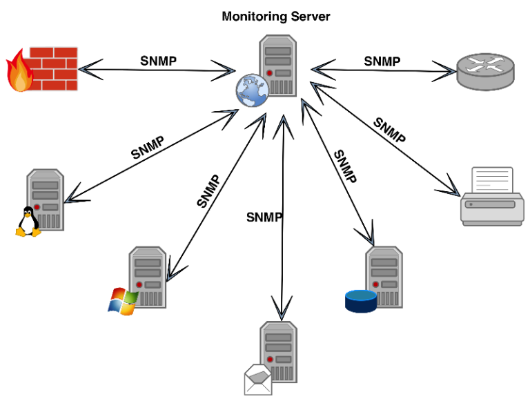

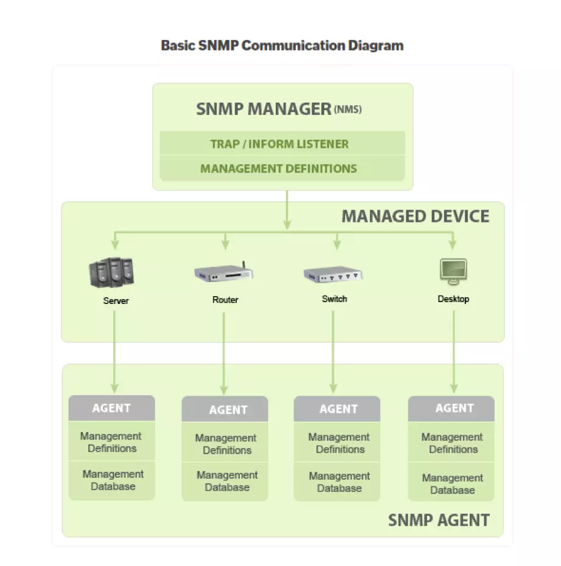

SNMP has three components:


Hoặc theo 1 tài liệu khác thì SNMP có 3 thành phần (tính thêm cả MIB là 1 thành phần)

- **a. Bộ phận quản lý (Manager)**

Network Management System (**NMS**): Trình quản lý hoặc hệ thống quản lý là một thực thể riêng biệt có trách nhiệm giao tiếp với các thiết bị mạng được triển khai SNMP agent. Đây thường là một máy tính được sử dụng để chạy một hoặc nhiều hệ thống quản lý mạng.

 > Ảnh thực tế 1 số SNMP management

- **b.A gent**

Agent là một chương trình được đóng gói trong các thiết bị mạng (máy tính, server, Firewall, các thiết bị phần cứng khác như Router, Switch,..). Việc kích hoạt agent cho phép nó thu thập cơ sở dữ liệu thông tin quản lý từ thiết bị cục bộ và cung cấp nó cho SNMP manager khi được truy vấn. Các agent này có thể là tiêu chuẩn (ví dụ: Net-SNMP) hoặc cụ thể cho một nhà cung cấp (ví dụ: HP insight agent).

Các chức năng chính của SNMP agent:

- Thu thập thông tin quản lý về các chỉ số hoạt động cuả thiết bị
- Lưu trữ và truy xuất thông tin quản lý như được định nghĩa trong MIB.
- Báo hiệu sự kiện cho trình quản lý.
- Hoạt động như một proxy cho một số nút mạng không quản lý được – SNMP.

**Đặc điểm của một Agent**

An agent can have many objects/sensors it can interact with. Some objects are part of an industry standard and some will be vendor-specific for this device. (In that case, information about these object should be found on vendors website)

For example, this agent has some objects like Name, uptime, interfaces, rounting table. Each object is assigned to an **OID** (OID is a sequence of number, look something similar to IP address, Ex: 1.3.6.1.2.1.2.2.1.8, use to indentify objects). These OID with their human-readable name is store in a text file **MIB**. (MIB stands for Management Information Base: a text file allow to translate numericlal OID to words, phrases human can understand)


> lấy vd các SNMP agent trên Linux (như snmpd), trên Window,...

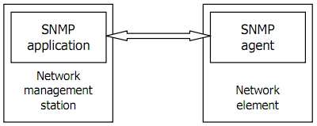

- **c. Cơ sở thông tin quản lý – MIB**
Trình bày kỹ trong Part 3

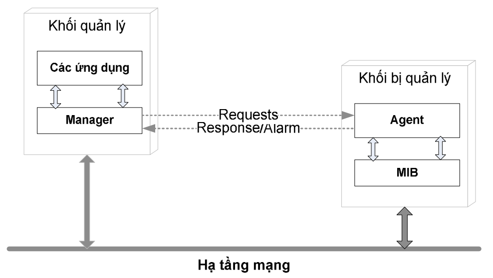

**Mô hình hoạt động của SNMP**
SNMP sử dụng các dịch vụ chuyển tải dữ liệu được cung cấp bởi các giao thức UDP/IP. Một ứng dụng của Manager phải nhận dạng được Agent cần thông tin với nó. Một ứng dụng của Agent được nhận dạng bởi địa chỉ IP của nó và một cổng UDP (cổng 161). Các bản tin sử dụng địa
chỉ IP và mã nhận dạng cổng UDP (cổng 162) của Manager SNMP. SNMP sử dụng 3 lệnh cơ bản là Read, Write, Trap và một số
lệnh tùy biến để quản lý thiết bị.

SNMP điều khiển, theo dõi thiết bị bằng cách thay đổi hoặc thu thập thông tin qua các biến giá trị lưu trên thiết bị. Các Agent cài đặt
trên thiết bị tương tác với những chip điều khiển hỗ trợ SNMP để đọc nội dung hoặc ghi nội dung. 
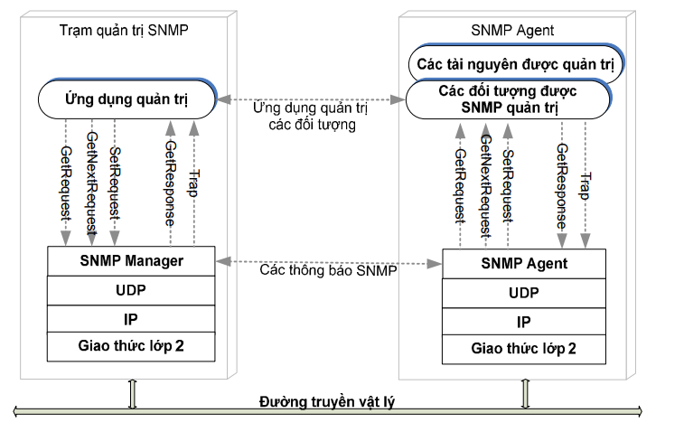 


# Part II: Network Monitoring With SNMP

### Vậy quá trình lấy và cung cấp thông tin từ agent cho NMS như thế nào

Một thiết bị hỗ trợ SNMP có thể cung cấp nhiều thông tin khác nhau, mỗi thông tin đó được gọi là một Object. Mỗi object có một tên gọi và một mã số để nhận dạng object đó, mã số gọi là Object ID (**OID**). Các OID này có thể tuân theo quy chuẩn hoặc do từng nhà sản xuất thiết bị quy định

 Lấy ví dụ một vài OID: 
- `"1.3.6.1.2.1.1.1.0"`: This is the OID for the System Description, which typically includes details about the operating system, specific version, and hardware details.


- `"1.3.6.1.2.1.25.3.2.1.3.1"`: This is the OID for the Processor Description, which typically includes CPU details.

- `"1.3.6.1.4.1.2021.4.5.0"`: This is the OID for Total RAM.

Mỗi chữ số trong dãy số của OID đều cí ý nghĩa riêng của nó, sẽ đc tìm hiểu kỹ hơn trong phần MIB.

Để lấy một thông tin có OID đã chuẩn hóa thì SNMP application phải gửi một bản tin SNMP có chứa OID của object đó cho SNMP agent, SNMP agent khi nhận được thì nó phải trả lời bằng thông tin ứng với OID đó.

VD : Muốn lấy tên của một PC chạy Windows, tên của một PC chạy Linux hoặc tên của một router thì SNMP application chỉ cần gửi bản tin có chứa OID là 1.3.6.1.2.1.1.5.0. Khi SNMP agent chạy trên PC Windows, PC Linux hay router nhận được bản tin có chứa OID 1.3.6.1.2.1.1.5.0, agent lập tức hiểu rằng đây là bản tin hỏi sysName.0, và agent sẽ trả lời bằng tên của hệ thống. Nếu SNMP agent nhận được một OID mà nó không hiểu (không hỗ trợ) thì nó sẽ không trả lời.
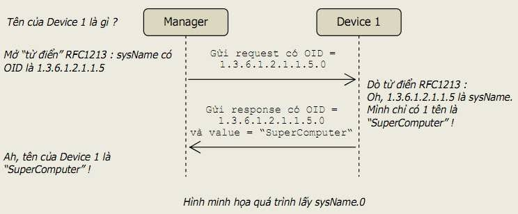

**Object access**

Mỗi object có quyền truy cập là READ_ONLY hoặc READ_WRITE. Mọi object đều có thể đọc được nhưng chỉ những object có quyền READ_WRITE mới có thể thay đổi được giá trị. VD : Tên của một thiết bị (sysName) là READ_WRITE, ta có thể thay đổi tên của thiết bị thông qua giao thức SNMP. Tổng số port của thiết bị (ifNumber) là READ_ONLY, dĩ nhiên ta không thể thay đổi số port của nó.


### SNMP Mesage

Trên kia là cách agent lấy, đọc dữ liệu và định danh nó để có thể gửi cho NMS, thế gửi, trao đổi những thông tin đó như nào ?
&rarr; Qua các SNMP Mesage

Các SNMP Mesage bao gồm nhiều command khác nhau: get, getNext, Trap,... nhưng nhìn chung được chia ra làm 2 loại chính: 


**1. Phương thức Poll**

When NMS actively requests information from the agent, then device respone info to the network monitor. All these actions happend on port ***161*** UDP (User Datagram Protocol)

Nguyên tắc hoạt động : Trung tâm giám sát (manager) sẽ thường xuyên hỏi thông tin của thiết bị cần giám sát (device). Nếu Manager không  hỏi  thì  Device  không  trả  lời,  nếu Manager hỏi thì Device phải trả lời. Bằng cách hỏi thường xuyên, Manager sẽ luôn cập nhật được thông tin mới nhất từ Device.

Ví dụ : Người quản lý cần theo dõi khi nào thợ làm xong việc. Anh ta cứ thường xuyên hỏi người thợ “Anh đã làm xong chưa ?”, và người thợ sẽ trả lời “Xong” hoặc “Chưa”.

**2. Phương thức Alert/ Notifying**

Agents actively communication back to NMS event without request from NMS. These are useful for monitoring critical events, errors. All these action happend in port ***162*** UDP

Nguyên  tắc  hoạt  động  :  Mỗi  khi  trong Device xảy ra một sự kiện (event) nào đó thì Device sẽ tự động gửi thông báo cho Manager, gọi là Alert. Manager không hỏi thông tin định kỳ từ Device.

Ví dụ : Người quản lý cần theo dõi tình hình làm việc của thợ, anh ta yêu cầu người thợ thông báo cho mình khi có vấn đề gì đó xảy ra. Người thợ sẽ thông báo các sự kiện đại loại như “Tiến độ đã hoàn thành 50%”, “Mất điện lúc 10h”, “Có điện lại lúc 11h”, “Mới có tai nạn xảy ra”.

Device chỉ gửi những thông báo mang tính sự kiện chứ không gửi những thông tin thường xuyên thay đổi, nó cũng sẽ không gửi Alert nếu chẳng có sự kiện gì xảy ra. Chẳng hạn khi một port down/up thì Device sẽ gửi cảnh báo, còn tổng số byte truyền qua port đó sẽ không được Device gửi đi vì đó là thông tin thường xuyên thay đổi. Muốn lấy những thông tin thường xuyên thay đổi thì Manager phải chủ động đi hỏi Device, tức là phải thực hiện phương thức Poll.


***Poll -> Chủ động, Alert -> Bị động***


### SNMP Mesage in Detail

**Nhóm Polling**

- **GetRequest** - Thiết bị mục tiêu sẽ trả về giá trị được yêu cầu cùng với tin nhắn phản hồi “Response”. VD : Muốn lấy thông tin tên của Device1 thì manager gửi bản tin GetRequest OID=1.3.6.1.2.1.1.5 đến Device1, tiến trình SNMP agent trên Device1 sẽ nhận được bản tin và tạo bản tin trả lời. Trong một bản tin GetRequest có thể chứa nhiều OID, nghĩa là dùng một GetRequest có thể lấy về cùng lúc nhiều thông tin.


- **GetNextRequest**- Trình quản lý SNMP có thể gửi loại tin nhắn này để khám phá thông tin nào có sẵn từ thiết bị. Bằng cách bắt đầu từ OID 0, trình quản lý có thể tiếp tục gửi yêu cầu cho dữ liệu có sẵn tiếp theo cho đến khi không còn dữ liệu “tiếp theo”. Bằng cách này, người dùng có thể khám phá tất cả dữ liệu có sẵn trên một thiết bị nhất định ngay cả khi họ có thể không có bất kỳ kiến ​​thức nào về hệ thống hoặc thiết bị phản hồi. In simple words: GET NEXT like GET, retrieves the value of the next OID in the MIB tree.

    *Tại sao phải có phương thức GetNextRequest ? Như bạn đã biết khi đọc qua những phần trên : một MIB bao gồm nhiều OID được sắp xếp thứ tự nhưng không liên tục (nói rõ trong Part 3), nếu biết một OID thì không xác định được OID kế tiếp. Do đó ta cần GetNextRequest để lấy về giá trị của OID kế tiếp. Nếu thực hiện GetNextRequest liên tục thì ta sẽ lấy được toàn bộ thông tin của agent.*

- **GetBulkRequest** - Được thêm vào SNMP Phiên bản 2, đây là phiên bản mới hơn, được tối ưu hóa của yêu cầu GetNextRequest. Phản hồi được trưng cầu sẽ chứa nhiều dữ liệu theo yêu cầu cho phép. Về cơ bản, đây là một cách để thực hiện một số GetNextRequests cùng một lúc, cho phép người dùng tạo danh sách tất cả dữ liệu và thông số có sẵn. In simple words This command retrieves bulk data from a large MIB table.


- **SetRequest** - Đây là lệnh do trình quản lý khởi xướng để đặt “Set” hoặc thay đổi “Change” giá trị của một tham số thông qua SNMP trên tác nhân thiết bị hoặc hệ thống. Loại tin nhắn này có thể được sử dụng để quản lý hoặc cập nhật cài đặt cấu hình hoặc các thông số khác. Managers use the SET command to modify or assign the value on the managed device, example Có thể đặt lại tên của một máy tính hay router bằng phần mềm SNMP manager, bằng cách gửi bản tin SetRequest có OID là 1.3.6.1.2.1.1.5.0 (sysName.0) và có giá trị là tên mới cần đặt.

    + Có thể shutdown một port trên switch bằng phần mềm SNMP manager, bằng cách gửi bản tin có ID là 1.3.6.1.2.1.2.2.1.7 (ifAdminStatus) và có giá trị là 2 (ifAdminStatus có thể mang 3 giá trị là UP (1), DOWN (2) và TESTING (3)).

   *Lưu ý: Chỉ những object có quyền READ_WRITE mới có thể thay đổi được giá trị.*


GET/GET NEXT/GET BULK/SET
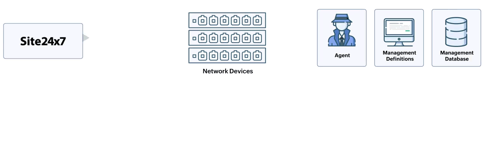


- **Response** -  Mỗi khi SNMP agent nhận được các bản tin GetRequest, GetNextRequest hay SetRequest thì nó sẽ gửi lại bản tin GetResponse để trả lời. Trong bản tin GetResponse có chứa OID của object được request và giá trị của object đó.Trong trường hợp SetRequest, gói tin sẽ phản hồi với giá trị mới được thiết lập như một xác nhận rằng SetRequest đã được hoàn thành thành công.


- **SNMPWALK**: Nhận tất cả dữ liệu

    SNMPWALK sử dụng nhiều request Get-Next để truy xuất toàn bộ cây dữ liệu mạng từ một đối tượng được quản lý. Công cụ iReasoning MIB Browser sẽ rất hữu ích để xem tất cả các OID mà một agent cung cấp.

- **Report** – SNMP v3 is needed to use Report messages. They allow an SNMP manager to determine what kind of problem was detected by the remote SNMP agent. Based on the detected error, the SNMP engine may try to send a corrected SNMP message. If that is not possible, it may pass an indication of the error to the application on whose behalf the failed SNMP request was issued. [RFC3412]


**Nhóm Alert**

- **Trap** - Message TRAP được khởi xướng bởi agent và gửi đến manager khi một sự kiện quan trọng xảy ra. Trap dùng để cảnh báo cho manager – thay vì đợi request trạng thái từ manager khi cần thăm dò ý kiến ​​của agent. Bản tin Trap được agent tự động gửi cho manager mỗi khi có sự kiện xảy ra bên trong agent, các sự kiện này không phải là các hoạt động thường xuyên của agent mà là các sự kiện mang tính biến cố. Ví dụ : Khi có một port down, khi có một người dùng login không thành công, hoặc khi thiết bị khởi động lại, agent sẽ gửi trap cho manager.

    Tuy nhiên không phải mọi biến cố đều được agent gửi trap, cũng không phải mọi agent đều gửi trap khi xảy ra cùng một biến cố. Việc agent gửi hay không gửi trap cho biến cố nào là do hãng sản xuất device/agent quy định.

    Phương thức trap là độc lập với các phương thức request/response. SNMP request/response dùng để quản lý còn SNMP trap dùng để cảnh báo. Nguồn gửi trap gọi là Trap Sender và nơi nhận trap gọi là Trap Receiver. Một trap sender có thể được cấu hình để gửi trap đến nhiều trap receiver cùng lúc.

    Có 2 loại trap : trap phổ biến (generic trap) và trap đặc thù (specific trap). Generic trap được quy định trong các chuẩn SNMP, còn specific trap do người dùng tự định nghĩa (người dùng ở đây là hãng sản xuất SNMP device). Loại trap là một số nguyên chứa trong bản tin trap, dựa vào đó mà phía nhận trap biết bản tin trap có nghĩa gì.

    Theo SNMPv1, generic trap có 7 loại sau : coldStart(0), warmStart(1), linkDown(2), linkUp(3), authenticationFailure(4), egpNeighborloss(5), enterpriseSpecific(6). Giá trị trong ngoặc là mã số của các loại trap. Ý nghĩa của các bản tin generic-trap như sau :

    + coldStart : thông báo rằng thiết bị gửi bản tin này đang khởi động lại (reinitialize) và cấu hình của nó có thể bị thay đổi sau khi khởi động.

    +   warmStart : thông báo rằng thiết bị gửi bản tin này đang khởi động lại và giữ nguyên cấu hình cũ.

    + linkDown : thông báo rằng thiết bị gửi bản tin này phát hiện được một trong những kết nối truyền thông (communication link) của nó gặp lỗi. Trong bản tin trap có tham số chỉ ra ifIndex của kết nối bị lỗi.

    + linkUp : thông báo rằng thiết bị gửi bản tin này phát hiện được một trong những kết nối truyền thông của nó đã khôi phục trở lại. Trong bản tin trap có tham số chỉ ra ifIndex của kết nối được khôi phục.

    + authenticationFailure : thông báo rằng thiết bị gửi bản tin này đã nhận được một bản tin không được chứng thực thành công (bản tin bị chứng thực không thành công có thể thuộc nhiều giao thức khác nhau như telnet, ssh, snmp, ftp, …). Thông thường trap loại này xảy ra là do user đăng nhập không thành công vào thiết bị.

    + egpNeighborloss : thông báo rằng một trong số những “EGP neighbor”  của thiết bị gửi trap đã bị coi là down và quan hệ đối tác (peer relationship) giữa 2 bên không còn được duy trì.

    + enterpriseSpecific : thông báo rằng bản tin trap này không thuộc các kiểu generic như trên mà nó là một loại bản tin do người dùng tự định nghĩa.

    Người dùng có thể tự định nghĩa thêm các loại trap để làm phong phú thêm khả năng cảnh báo của thiết bị như : boardFailed, configChanged, powerLoss, cpuTooHigh, v.v…. Người dùng tự quy định ý nghĩa và giá trị của các specific trap này, và dĩ nhiên chỉ những trap receiver và trap sender hỗ trợ cùng một MIB mới có thể hiểu ý nghĩa của specific trap. Do đó nếu bạn dùng một phần mềm trap receiver bất kỳ để nhận trap của các trap sender bất kỳ, bạn có thể đọc và hiểu các generic trap khi chúng xảy ra; nhưng bạn sẽ không hiểu ý nghĩa các specific trap khi chúng hiện lên màn hình vì bản tin trap chỉ chứa những con số.


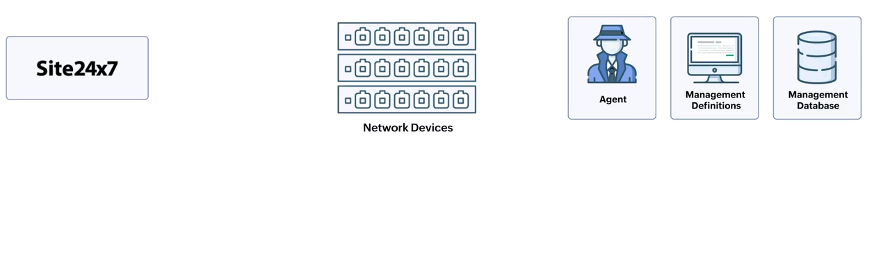

- **INFORM** - rất giống với TRAP, nhưng chúng đáng tin cậy hơn. Các message INFORM được khởi tạo bởi agent và khi manager nhận được nó, nó sẽ gửi response đến agent cho biết message đã được nhận. Nếu agent không nhận được response từ manager thì agent sẽ gửi lại message INFORM.

    An Inform message will wait for acknowladgament from NMS, if it does not recieve one it will resend the Inform. A Trap is on the othterhand, send and then forgotten


# Part III: Management Information Base (MIB)


### Over view

MIB (Management Information Base) là một cấu trúc dữ liệu gồm các đối tượng được quản lý (managed object), được dùng cho việc quản lý các thiết bị chạy trên nền TCP/IP. MIB là kiến trúc chung mà các giao thức quản lý trên TCP/IP nên tuân theo, trong đó có SNMP. MIB được thể hiện thành 1 file (MIB file), và có thể biểu diễn thành 1 cây (MIB tree). MIB có thể được chuẩn hóa hoặc tự tạo.

Or in simple words, MIB is a text file allow to translate numericlal OID to words, phrases human can understand


The MIB follow a tree structure. For example, this is th MIB of sys object. Each level have number, this is where the numberiacl sequence in OID comes from (we can call it by id or name)


MIB files are usually written in ASN.1 (Abstract Syntax Notation One) format and typically have the extension `.mib` or `.my`. These files define the structure of the information (objects) that can be retrieved or set via SNMP. They are used by network management systems to understand the data that devices send them. 

Here's an example of what a MIB file might look like:

```asn
MY-MIB DEFINITIONS ::= BEGIN

IMPORTS
    OBJECT-TYPE
        FROM SNMPv2-SMI
    DisplayString
        FROM SNMPv2-TC;

myDevice OBJECT IDENTIFIER ::= { enterprises 12345 }

deviceName OBJECT-TYPE
    SYNTAX      DisplayString (SIZE (0..255))
    MAX-ACCESS  read-only
    STATUS      current
    DESCRIPTION
            "The name of my device."
    ::= { myDevice 1 }

END
```

In this example, `myDevice` is an object identifier and `deviceName` is an object type that represents the name of the device. The `deviceName` object is read-only, meaning it can be retrieved but not changed via SNMP.

OR

SMI mô tả các đối tượng bị quản lý thông qua ngôn ngữ mô tả
ASN.1. Việc định nghĩa đối tượng gồm các trường:
- Đối tượng (Object): Tên của đối tượng, còn được coi như là
phần mô tả đối tượng cho mỗi loại đối tượng cùng với phần nhận dạng
đối tượng tương ứng của đối tượng.
- Cú pháp (Syntax): Cú pháp cho loại đối tượng. Đó có thể là
một trong các loại cú pháp đơn giản như: Integer, Octet String, Object
Identifier, Null hay một cú pháp ứng dụng như: Địa chỉ mạng, bộ đếm,
kiểu Gause, Time Ticks, dạng dữ liệu không trong suốt, hay các loại dữ
liệu ứng dụng mở rộng.
- Định nghĩa (Definition): Các định nghĩa mô tả ngữ nghĩa của
loại đối tượng. 
- Truy nhập (Access): Phương pháp truy nhập có thể là: chỉ
đọc, đọc-ghi hay không thể truy nhập.
- Trạng thái (Status): Có thể là cưỡng chế, tùy chọn hay không
còn hiệu lực.

Ví dụ: Định nghĩa một đối tượng sysUpTime trong MIB-II 
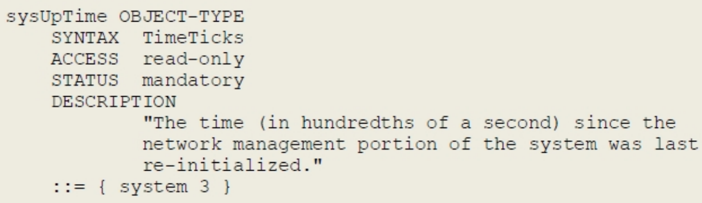

### MIB strucutre in detail

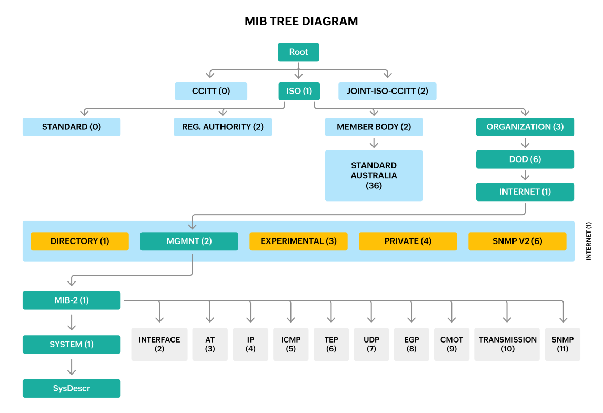


Nút gốc của cây phân trong MIB không có tên. Dưới gốc là 3 cây con gồm:
- **Ccitt(0)**: do CCITT quản lý (Consultative Committee for
International Telephone and Telegraph).
- **Iso(1)**: do tổ chức ISO quản lý (International Organization
for Standardization).

    Dưới nhánh iso(1), tổ chức ISO thiết kế một nhánh dành cho
các tổ chức khác là org(3). Dưới org(3) có nhiều nhánh con, một nhánh
được dành riêng cho Bộ Quốc phòng Mỹ, dod(6), dưới dod(6) có một
nhánh dành cho cộng đồng internet ngày nay, là nhánh internet(1). Tất 
cả mọi thứ thuộc về cộng đồng Internet đều nằm dưới
.iso.org.dod.internet, mọi object của các thiết bị TCP/IP đều bắt đầu với
prefix .1.3.6.1 (dấu chấm đầu tiên biểu diễn rằng .iso là cây con của
gốc, và gốc thì không có tên).

    Với mục tiêu quản lý các nhóm giao thức trong mô hình
TCP/IP và mạng Internet, thì nhánh Internet được chia ra thành 4 nhóm
lớn: Thư mục, quản lý, thử nghiệm và nhóm riêng: 
    - Nhóm thư mục: Hỗ trợ các thư mục trong OSI X.500
    - Nhóm **quản lý**: Gồm các đối tượng của Internet còn gọi là
cây MIB-II (RFC1213)
    - Nhóm thử nghiệm: Sử dụng cho quá trình thử nghiệm trước
khi chuyển sang nhóm quản lý.
    - Nhóm **riêng**: Gồm các đặc tả của các nhà cung cấp thiết bị và
các vùng gia tăng giá trị. 

    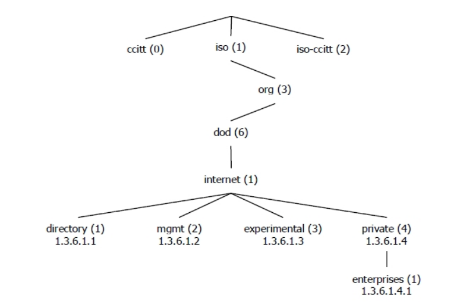

    Theo hướng nhóm **quản lý**:
    
    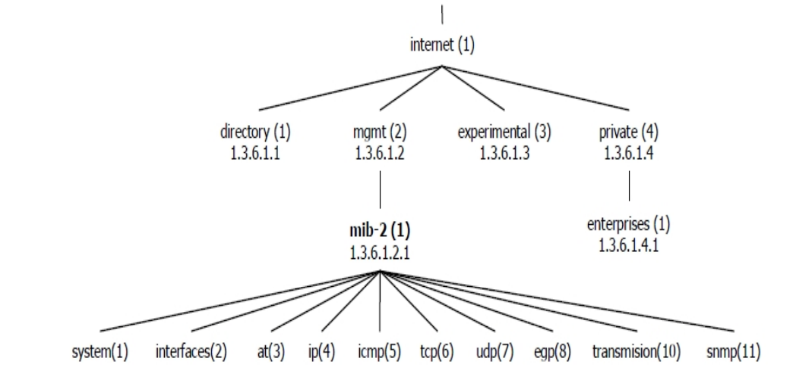
    
    MIB-II đưa ra các biến số để quản lý gồm 11 cây chức năng con được chỉ ra trên hình 1.11. Các cây con này lại tiếp tục được chia ra thành các cây con cấp thấp hơn như đối tượng hệ thống và các bảng con tương ứng với các lá. Lá được sử dụng để đánh dấu các biến số bị quản lý thuộc một loại nhất định. Một số lá  như mô tả hệ thống sysDesc chỉ ghi nhận một giá trị của biến số bị quản lý và chỉ đòi hỏi một phần tử lưu trữ duy nhất. Những lá khác, ví dụ như mô tả trạng thái kết nối TCP tcpConnState có thể cần ghi nhận kết nối xẩy ra ở nhiều thời điểm khác nhau. Các thời điểm khác nhau này sẽ được tổ chức thành các cột, các cột này tạo thành một bảng mà các hàng của bảng này biểu diễn các thông số của một thực thể ở những thời điểm khác nhau.
        
        > Chưa hiểu đoạn dưới này lắm

    Cụ thể hơn nữa về MIB-II: phân tách đối tượng quản lý thành 11 nhóm đối tượng. Cụ thể hơn về từng nhóm đối tượng: 
    - **a. Nhóm hệ thống 1.3.6.1.2.1.1**: Nhóm hệ thống mô tả tổng quan về hệ thống bị quản lý dưới dạng văn bản ký tự ASCII. Bao gồm nhận dạng đối tượng, độ dài thời
    gian từ thời điểm tái khởi động thực thể quản lý mạng và những chi tiết
    quản lý khác. 
    - **b. Nhóm giao diện 1.3.6.1.2.1.2**: Nhóm giao diện gồm 23 nhận dạng đối tượng cung cấp các thông tin như: hiệu năng, cấu hình và trạng thái cho tất cả các loại giao diện.
    - **c.Nhóm biên dịch địa chỉ 1.3.6.1.2.1.3**: Nhóm phiên dịch địa chỉ cung cấp một bảng để phiên dịch giữa địa chỉ IP và địa chỉ (phần cứng) vật lý.
    - **d. Nhóm giao thức internet IP 1.3.6.1.2.1.4**: Nhóm giao thức IP chứa các đối tượng bị quản lý cung cấp chức năng về phân hệ IP của một node.
    - **e.Nhóm giao thức bản tin điều khiển internetICMP 1.3.6.1.2.1.5**: Nhóm giao thức bản tin điều khiển Internet là thành phần bắtbuộc của IP và được định nghĩa trong RFC 792. Nhóm ICMP cung cấp các bản tin điều khiển nội mạng và thực hiện nhiều vận hành ICMP
    trong thực thể bị quản lý.
    - **f.Nhóm giao thức TCP 1.3.6.1.2.1.6** Nhóm giao thức điều khiển truyền tải là bắt buộc và cung cấp thông tin liên quan tới vận hành và kết nối TCP.
    - **g.Nhóm giao thức UDP 1.3.6.1.2.1.7** Nhóm giao thức dữ liệu đồ người sử dụng là bắt buộc và cung cấp thông tin liên quan tới hoạt động UDP.
    - **h.Nhóm giao thức cổng ngoài 1.3.6.1.2.1.8** Nhóm giao thức cổng ngoài là bắt buộc với mọi hệ thống có triển khai EGP. EGP truyền đạt thông tin giữa các hệ thống tự trị
    (autonomous systems), và được mô tả chi tiết trong RFC904.
    - **i. Nhóm CMOT 1.3.6.1.2.1.9**: Hiện tại, RFC 1214 được xếp loại là giao thức “quá khứ”.
    - **j. Nhóm truyền dẫn 1.3.6.1.2.1.10**: Nhóm truyền dẫn chứa các đối tượng liên quan đến việc truyền dẫn dữ liệu. RFC 1213 không định nghĩa những đối tượng này rõ ràng. 
    - **k.Nhóm giao thức SNMP**: Nhóm SNMP cung cấp thông tin về các đối tượng SNMP. 


  

    Theo hướng nhóm **riêng**:

    


     Các OID của các hãng tự thiết kế nằm dưới iso.org.dod.internet.private.enterprise. Ví dụ : Cisco nằm dưới iso.org.dod.internet.private.enterprise.cisco hay 1.3.6.1.4.1.9, Microsoft nằm dưới iso.org.dod.internet.private.enterprise.microsoft hay 1.3.6.1.4.1.311. Số 9 (Cisco) hay 311 (Microsoft) là số dành riêng cho các công ty do IANA cấp. Nếu Cisco hay Microsoft chế tạo ra một thiết bị nào đó, thì thiết bị này có thể hỗ trợ các MIB chuẩn đã được định nghĩa sẵn (như mib-2) hay hỗ trợ MIB được thiết kế riêng. Các MIB được công ty nào thiết kế riêng thì phải nằm bên dưới OID của công ty đó.

- **iso-ccitt(2)**: do cả ISO và CCITT quản lý.

     

Nhóm đã thử một API có tên Mibble có khả năng xử lý trực tiếp file Mib dạng ASN1 nhưng có một vài vấn đề do API mà nó không trả về kiểu đữ liệu như 
mong muốn nnên sau cùng bọn em vẫn phải dùng pysmi để chuyyẻn sang file dạng JSON rồi parse thủ công.

cấu trúc cảu một Object trong fiel JSON:

```json
  "sysDescr": {
    "name": "sysDescr",
    "oid": "1.3.6.1.2.1.1.1",
    "nodetype": "scalar",
    "class": "objecttype",
    "syntax": {
      "type": "DisplayString",
      "class": "type",
      "constraints": {
        "size": [
          {
            "min": 0,
            "max": 255
          }
        ]
      }
    },
    "maxaccess": "read-only",
    "status": "mandatory",
    "description": "A textual description of the entity. This value should include the full name and version identification of the system's hardware type, software operating-system, and networking software. It is mandatory that this only contain printable ASCII characters."
  }
```
sysDescr (Outer Key)

    Definition: This is the name of the MIB object. It's used as a key in the JSON structure to uniquely identify the MIB object.

name

    Definition: The name of the MIB object, which is usually the same as the outer key. It provides a human-readable identifier for the MIB object.
    Example: "name": "sysDescr"

oid

    Definition: The Object Identifier (OID) is a globally unique identifier for the MIB object. It is used to identify the object in SNMP (Simple Network Management Protocol) operations.
    Example: "oid": "1.3.6.1.2.1.1.1"

nodetype

    Definition: This specifies the type of node, such as scalar or table. A scalar node represents a single data item, while a table node represents a collection of related data items.
    Example: "nodetype": "scalar"

https://stackoverflow.com/questions/41844706/using-pysnmp-mib-browser-how-to-determine-a-scalar-or-a-tabular-oid

https://docs.oracle.com/cd/E95618_01/html/sbc_scz810_mibguide/GUID-050076D7-8339-4AB8-8CF5-3D07DB3754DC.htm

class

    Definition: This field specifies the class of the MIB object. In this case, it's "objecttype," which indicates that this is a defined object type within the MIB.
    Example: "class": "objecttype"

syntax

    Definition: The syntax field provides information about the data type and constraints for the MIB object. It usually includes the type and any constraints on the data.
maxaccess

    Definition: This specifies the maximum access level for the MIB object. Common values are read-only, read-write, or no-access. It indicates whether the value can be read and/or modified.
    Example: "maxaccess": "read-only"

status

    Definition: The status of the MIB object indicates its implementation status. Common values are current, deprecated, or mandatory. This helps in understanding whether the object is actively used or is being phased out.
    Example: "status": "mandatory"

description

    Definition: A textual description of the MIB object. It provides detailed information about the object, including its purpose and any important notes. This field helps administrators understand what the MIB object represents and how it should be used.


The class field in the JSON representation of a MIB node can be important depending on the specific requirements and functionality of your SNMP browser. Here’s a breakdown of what the class field represents and how it might be used:
Understanding the class Field

The class field typically indicates the type or category of the MIB node. Here are some common values you might encounter and their meanings:

    objecttype:
        This indicates that the node is an object type, which is a basic element in the MIB. Object types define variables that can be read or written via SNMP.
        Example: An OID representing a scalar value or an entry in a table.

    type:
        This indicates a type definition, which is used to specify the data type of a variable in the MIB.
        Example: Integer32, OCTET STRING, OBJECT IDENTIFIER, etc.

    objectgroup:
        This indicates a grouping of related objects, often used to simplify the structure of the MIB and make it easier to manage.
        Example: A group of related scalar objects or table entries.

    notificationgroup:
        This indicates a group of notifications (traps or informs) that are related.
        Example: Notifications that are grouped together for easier management.

    compliance:
        This indicates compliance statements, which specify which parts of the MIB must be implemented to be compliant with a standard.
        Example: Specifications about mandatory objects for compliance.

***Lưu ý:***

- ***Các objectID trong MIB được sắp xếp thứ tự nhưng không phải là liên tục, khi biết một OID thì không chắc chắn có thể xác định được OID tiếp theo trong MIB. VD trong chuẩn mib-2 thì object ifSpecific  và object atIfIndex nằm kề nhau nhưng OID lần lượt là 1.3.6.1.2.1.2.2.1.22 và 1.3.6.1.2.1.3.1.1.1.***

- ***Một object chỉ có một OID, chẳng hạn tên của thiết bị là một object. Tuy nhiên nếu một thiết bị lại có nhiều tên thì làm thế nào để phân biệt ? Lúc này người ta dùng thêm 1 chỉ số gọi là “scalar instance index” (cũng có thể gọi là “sub-id”) đặt ngay sau OID. Ví dụ : Tên thiết bị được gọi là sysName, OID là 1.3.6.1.2.1.1.5; nếu thiết bị có 2 tên thì chúng sẽ được gọi là sysName.0 & sysName.1 và có OID lần lượt là 1.3.6.1.2.1.1.5.0 & 1.3.6.1.2.1.1.5.1.***

    Ở hầu hết các thiết bị, các object có thể có nhiều giá trị thì thường được viết dưới dạng có sub-id. VD một thiết bị dù chỉ có 1 tên thì nó vẫn phải có OID là sysName.0 hay 1.3.6.1.2.1.1.5.0. Bạn cần nhớ quy tắc này để ứng dụng trong lập trình phần mềm SNMP manager.

    Sub-id không nhất thiết phải liên tục hay bắt đầu từ 0. VD một thiết bị có 2 mac address thì có thể chúng được gọi là ifPhysAddress.23 và ifPhysAddress.125645.

Muốn hiểu được một OID nào đó thì bạn cần có file MIB mô tả OID đó. Một MIB file không nhất thiết phải chứa toàn bộ cây ở trên mà có thể chỉ chứa mô tả cho một nhánh con. Bất cứ nhánh con nào và tất cả lá của nó đều có thể gọi là một mib. Một manager có thể quản lý được một device chỉ khi ứng dụng SNMP manager và ứng dụng SNMP agent cùng hỗ trợ một MIB. Các ứng dụng này cũng có thể hỗ trợ cùng lúc nhiều MIB.

# Part IV: SNMP versions
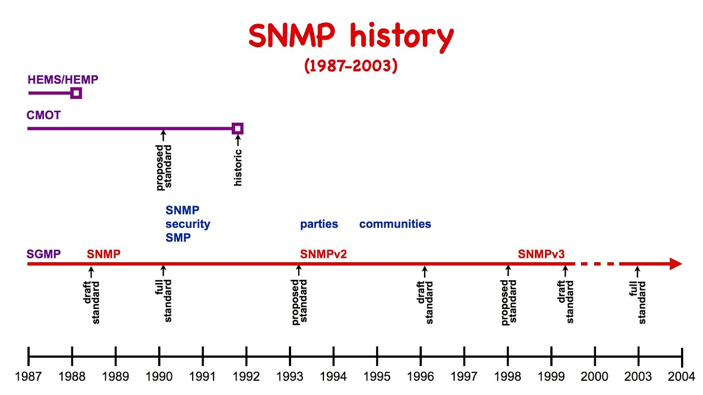


Các phiên bản của SNMP

SNMP có 3 phiên bản : **SNMPv1**, **SNMPv2c**, và **SNMPv3**. Các phiên bản này khác nhau một chút ở định dạng bản tin và phương thức hoạt động. 


- **SNMPv1**
    
    The original version of SNMP, referred to as SNMPv1, has critical security and performance limitations. SNMPv1 provides authentication, which is based on a password (community string). The community string is sent in clear text between the NMS manager and the agents. Therefore, the managed device is vulnerable to unauthorized users who can easily reconfigure the device, especially if IP access control lists (ACLs) are not in place. The SNMPv1 and 2c data exchanged between the NMS administrator and the agents are not encrypted. 

    Regarding SNMPv1 protocol performance, the set of protocol transactions is limited to Gets, Sets, and Traps of individual objects in the MIB. Therefore, large sets of information require several transactions to retrieve a row of information.

- **SNMPv2c**

    SNMPv2c is the successor to the original SNMPv1. The standard MIB2 integer is 32 bits long in the case of SNMPv1; SNMPv2 defines a new type of integer that is 64 bits long. A 64-bit counter can better handle high-speed interfaces because 32-bit counters do not provide enough capacity and must wrap quickly. This increases network traffic and has a negative impact on both the agent and the NMS manager CPU utilization.

    SNMPv2c also improves the performance of SNMPv1 by introducing the Get Bulk Requests operation. If the NMS manager wants to retrieve a large amount of data, it sends a GetBulk message to the agent instead of a Get request. The GetBulk operation provides values for all variables in the list and is much more efficient than sending repetitive GetNext commands.

    SNMpv2c introduces a new type of SNMP communication – SNMP Inform request. Typically, an SNMP Inform is used for manager-to-manager communication to acknowledge receipt of notification. The SNMP inform request packet will be sent continually until the sending SNMP manager receives an SNMP acknowledgment.

    Both SNMPv2c and SNMPv1 protocols use simple authentication, which relies on community names.

    SNMP v2 hỗ trợ bộ đếm 64 bit nhưng vẫn gửi dữ liệu quan trọng dưới dạng văn bản (Text), vì vậy nó không thực sự tăng cường bảo mật. Và nếu người dùng bắt gặp SNMP v2, đó hầu hết là "SNMP v2c" mà các nhà sản xuất hoặc nhà mạng đang nói đến, với chữ "c" là viết tắt của từ "cộng đồng - Community". Hai phiên bản SNMP v2 khác tồn tại, SNMP v2p và SNMP v2u, nhưng chúng chỉ được triển khai trong một số trường hợp hiếm hoi


    SNMPv2u is a user-based security model, as specified in RFC 1909 and RFC 1910.
    SNMPv2c is a common community-based security model.
    SNMP 2u offers per-user authentication, similar to SNMPv3. SNMPv2u never really took off in the wild; anyone who wants per-user authentication uses SNMPv3. For more details (and there are a lot), consider this article in the Simple Times.

- **SNMPv3**

    SNMPv3 is the latest SNMP protocol that addresses the security issues introduced by older SNMP versions. SNMpv3 provides message integrity, authentication, and encryption by implementing SNMP View, SNMP Group, and SNMP User.

    SNMP View defines what a particular SNMpv3 user can view. For example, it is possible to configure that a user will only have access to view the interface index, OID 1.3.6.1.2.1.2, and anything below that.
    To create an all-access View the name iso should be specified. The MIB has a tree structure so anything below the iso can be accessed (Figure 2).

    SNMP Group is associated with the SNMP View and it defines a type of the access – read-only or read/write. It also defines the type of security that is active when interacting with the device.

    - noauth – nor authentication or encryption

   - auth – only authentication, no encryption

   - priv – authentication and encryption

SNMP User is added to the group with the level of authentication and encryption. The security model must match the group, e.g. priv, a type of the hash for the password (e.g. SHA), the password, encryption algorithm (e.g. AES), and a shared secret for generating encryption keys.

Some avaiable commands in each SNMP version

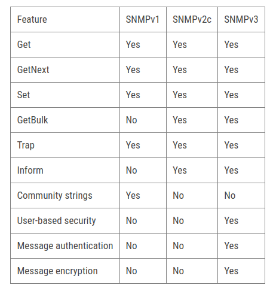

**Can SNMPv2 and SNMPv3 coexist?**
Yes, SNMPv2 and SNMPv3 can coexist. In a typical management scenario, the network management system communicates with SNMP agents of different versions. A multilingual agent, which supports all three versions, can coexist with agents that support only a single version. This is defined in RFC 25.

This coexistence is more commonly used while migrating from SNMPv2 to SNMPv3. Once migrated, it is recommended to disable the older versions.


***Bỏ qua vấn đề về cải thiện hiệu năng , phần này ta chỉ bàn về sư tiến hóa trong cơ chế bảo mật của SNMP:***

Một SNMP management station có thể quản lý/giám sát nhiều SNMP element, thông qua hoạt động gửi request và nhận trap. Tuy nhiên một SNMP element có thể được cấu hình để chỉ cho phép các SNMP management station nào đó được phép quản lý/giám sát mình.

Các cơ chế bảo mật đơn giản này gồm có : community string, view và SNMP access control list.

- **Community string**

    Community string là một chuỗi ký tự được cài đặt giống nhau trên cả SNMP manager và SNMP agent, đóng vai trò như “mật khẩu” giữa 2 bên khi trao đổi dữ liệu. Community string có 3 loại : 

    - Read-community: Khi  manager  gửi GetRequest,  GetNextRequest đến agent  thì  trong bản tin gửi  đi  có  chứa  Read- Community. Khi agent nhận được bản tin request thì nó sẽ so sánh Read-community do manager gửi và Read-community mà nó được cài đặt. Nếu 2 chuỗi này giống nhau, agent sẽ trả lời; nếu 2 chuỗi này khác nhau, agent sẽ không trả lời.

    - Write-Community: Write-Community được dùng trong bản tin SetRequest. Agent chỉ chấp nhận thay đổi dữ liệu khi write- community 2 bên giống nhau.


    - Trap-Community: nằm trong bản tin trap của trap sender gửi cho trap receiver. Trap receiver chỉ nhận và lưu trữ bản tin trap chỉ khi trap-community 2 bên giống nhau, tuy nhiên cũng có nhiều trap receiver được cấu hình nhận tất cả bản tin trap mà không quan tâm đến trap-community.

 
Community string có 3 loại như trên nhưng cùng một loại có thể có nhiều string khác nhau. Nghĩa là một agent có thể khai báo nhiều read-community, nhiều write-community.

Trên hầu hết hệ thống, read-community mặc định là “public”, write-community mặc định là “private” và trap-community mặc định là “public”.

Community string chỉ là chuỗi ký tự dạng cleartext, do đó hoàn toàn có thể bị nghe lén khi truyền trên mạng. Hơn nữa, các community mặc định thường là “public” và “private” nên nếu người quản trị không thay đổi thì chúng có thể dễ dàng bị dò ra. Khi community string trong mạng bị lộ, một người dùng bình thường tại một máy tính nào đó trong mạng có thể quản lý/giám sát toàn bộ các device có cùng community mà không được sự cho phép của người quản trị.

View

Khi manager có read-community thì nó có thể đọc toàn bộ OID của agent. Tuy nhiên agent có thể quy định chỉ cho phép đọc một số OID có liên quan nhau, tức là chỉ đọc được một phần của MIB. Tập con của MIB này gọi là view, trên agent có thể định nghĩa nhiều view. Ví dụ : agent có thể định nghĩa view interfaceView bao gồm các OID liên quan đến interface, storageView bao gồm các OID liên quan đến lưu trữ, hay AllView bao gồm tất cả các OID.

Một view phải gắn liền với một community string. Tùy vào community string nhận được là gì mà agent xử lý trên view tương ứng. Ví dụ : agent định nghĩa read-community “inf” trên view interfaceView, và “sto” trên storageView; khi manager gửi request lấy OID ifNumber với community là “inf” thì sẽ được đáp ứng do ifNumber nằm trong interfaceView; nếu manager request OID hrStorageSize với community “inf” thì agent sẽ  không  trả  lời  do  hrStorageSize  không  nằm  trong  interfaceView;  nhưng  nếu  manager  request hrStorageSize với community “sto” thì sẽ được trả lời do hrStorageSize nằm trong storageView.

Việc định nghĩa các view như thế nào tùy thuộc vào từng SNMP agent khác nhau. Có nhiều hệ thống không hỗ trợ tính năng view.

SNMP access control list

Khi manager gửi không đúng community hoặc khi OID cần lấy lại không nằm trong view cho phép thì agent sẽ không trả lời. Tuy nhiên khi community bị lộ thì một manager nào đó vẫn request được thông tin. Để ngăn chặn hoàn toàn các SNMP manager không được phép, người quản trị có thể dùng đến SNMP access control list (ACL).

SNMP ACL là một danh sách các địa chỉ IP được phép quản lý/giám sát agent, nó chỉ áp dụng riêng cho giao thức SNMP và được cài trên agent. Nếu một manager có IP không được phép trong ACL gửi request thì agent sẽ không xử lý, dù request có community string là đúng.

Đa số các thiết bị tương thích SNMP đều cho phép thiết lập SNMP ACL.


# Structure of an data unit in snmp
Các đặc tính của giao thức SNMPv2 và SNMPv3


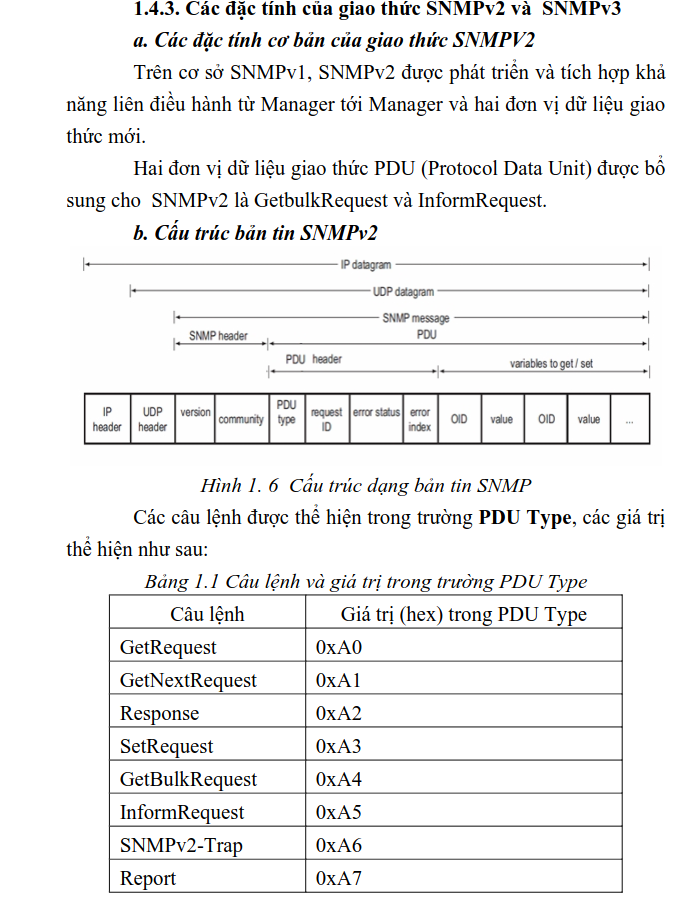
# Part V: Programming


SNMP PDU (Protocol Data Unit) or SNMP message contains a header, get/set header, trap header, and variable bindings. The following figure shows the SNMP message structure.


The structure of an SNMP (Simple Network Management Protocol) Protocol Data Unit (PDU) is designed to facilitate effective communication between an SNMP Manager and an SNMP Agent. Here’s a breakdown of the typical structure of an SNMP PDU:

    Version: Indicates the version of SNMP being used, such as SNMPv1, SNMPv2c, or SNMPv31.
    Community String: Acts as a password to authenticate the source or destination of the PDU (mainly in SNMPv1 and SNMPv2c).
    PDU Type: Defines the operation to be performed, such as GET, GET-NEXT, SET, TRAP, etc.
    Request ID: A unique identifier for each request to match requests with responses.
    Error Status: Indicates if there was an error in processing the request and the type of error.
    Error Index: Specifies the variable binding in which the error occurred.
    Variable Bindings: A list of pairs of object identifiers (OIDs) and their values. This is where the actual data for the request or response is contained.

Each of these components plays a crucial role in the management and monitoring of network devices via SNMP. The PDU contains all the necessary information needed for the SNMP entities to understand each other’s requests and responses2. It’s like a well-organized envelope containing not just the message but also metadata that aids in the sorting and delivery of the communication2.

More detail: https://www.ranecommercial.com/legacy/note161.html
# Ref:


1. Over view

As mentioned across the chappter 2 theory, thhe application only contains Get,   operate on SNMPv2c


2. Furture Works

Develop for GetBulk, Set, Trap and Inform
Migrating SNMPv3 to enhance security
Optimize the seraching process in SNMP Walk to reduce execution time. May be read all Mib file then store in a databse, apply database tuning so no nee dto look up mib file .
