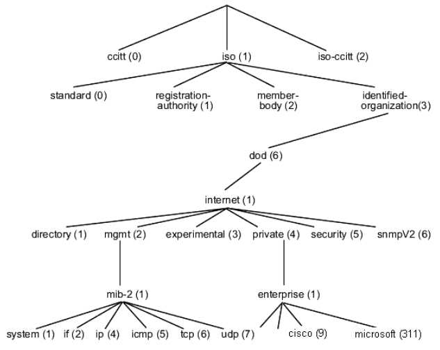

# Part I: SNMP Protocol
## Introduction

Giới thiệu 3 bài toán thuộc phổ biến nhất trong các ứng dụng của SNMP.

**1. Giám sát tài nguyên máy chủ**


Giả sử bạn có hàng ngàn máy chủ chạy các hệ điều hành (HĐH) khác nhau. Làm thế nào có thể giám sát tài nguyên (tỷ lệ chiếm dụng CPU, dung lượng còn lại của ổ cứng, tỷ lệ sử dụng bộ nhớ RAM...) của tất cả máy chủ hàng ngày, hàng giờ để kịp thời phát hiện các máy chủ sắp bị quá tải ? Bạn không thể kết nối vào từng máy để xem vì số lượng máy nhiều và vì các HĐH khác nhau có cách thức kiểm tra khác nhau.

&rarr;  Để giải quyết vấn đề này bạn có thể dùng một ứng dụng SNMP giám sát được máy chủ, nó sẽ lấy được thông tin từ nhiều HĐH khác nhau. 

> Tìm ảnh minh họa, trong thực tế dùng phần mền gì để giám sát ......tìm hiêu sau

**2. Giám sát lưu lượng trên các port của switch, router**

Bạn có hàng ngàn thiết bị mạng của nhiều hãng khác nhau, mỗi thiết bị có nhiều port. Làm thế nào để giám sát lưu lượng đang truyền qua tất cả các port của các thiết bị suốt 24/24, kịp thời phát hiện các port sắp quá tải ?
Bạn cũng không thể kết nối vào từng thiết bị để gõ lệnh lấy thông tin vì thiết bị của các hãng khác nhau có lệnh khác nhau.

&rarr;  Để giải quyết vấn đề này bạn có thể dùng một ứng dụng SNMP giám sát lưu lượng, nó sẽ lấy được thông tin lưu lượng đang truyền qua các thiết bị của nhiều hãng khác nhau. 

**3. Hệ thống tự động cảnh báo sự cố tức thời**

Bạn có hàng ngàn thiết bị mạng và chúng có thể gặp nhiều vấn đề trong quá trình hoạt động như : một port nào đó bị mất tín hiệu (port down), có ai đó đã cố kết nối (login) vào thiết bị nhưng nhập sai username và password, thiết bị vừa mới bị khởi động lại (restart), …. Làm thế nào để người quản trị biết được sự kiện khi nó vừa mới xảy ra ?

*Vấn đề này khác với hai vấn đề ở trên. Ở trên là làm thế nào cập nhật liên tục một số thông tin nào đó (biết trước sẽ lấy cái gì), còn ở đây là làm thế nào biết được cái gì xảy ra (chưa biết cái gì sẽ đến).*

&rarr;  Để giải quyết bài toán này bạn có thể dùng ứng dụng thu thập sự kiện (event) và cảnh báo (warning) bằng SNMP, nó sẽ nhận cảnh báo từ tất cả các thiết bị và hiện nó lên màn hình hoặc gửi email cho người quản trị.

### What exactly SNMP is ?
- SNMP stands for ***Simple Network Management Protocol***

>So sánh với các protocol khác, có ưu điểm gì mà lại đi dùng SNMP ?????

*Giao thức (protocol) là một tập hợp các thủ tục mà các bên tham gia cần tuân theo để có thể giao tiếp được với nhau. Trong lĩnh vực thông tin, một giao thức quy định cấu trúc, định dạng (format) của dòng dữ liệu trao đổi với nhau và quy định trình tự, thủ tục để trao đổi dòng dữ liệu đó. Nếu một bên tham gia gửi dữ liệu không đúng định dạng hoặc không theo trình tự thì các bên khác sẽ không hiểu hoặc từ chối trao đổi thông tin.*

&rarr; SNMP là một giao thức, do đó nó có những quy định riêng mà các thành phần trong mạng phải tuân theo. Một thiết bị hiểu được và hoạt động tuân theo giao thức SNMP được gọi là “có hỗ trợ SNMP” (SNMP supported) hoặc “tương thích SNMP” (SNMP compartible).

### What does SNMP use for ?

- SNMP dùng để quản lý, nghĩa là có thể theo dõi, có thể lấy thông tin, có thể được thông báo, và có thể tác động để hệ thống hoạt động như ý muốn. VD một số khả năng của phần mềm SNMP :

    + Theo dõi tốc độ đường truyền của một router, biết được tổng số byte đã truyền/nhận.

    + Lấy thông tin máy chủ đang có bao nhiêu ổ cứng, mỗi ổ cứng còn trống bao nhiêu.

    + Tự động nhận cảnh báo khi switch có một port bị down.

    + Điều khiển tắt các port trên switch.

- SNMP dùng để quản lý mạng, nghĩa là nó được thiết kế để chạy trên nền TCP/IP và quản lý các thiết bị có nối mạng TCP/IP. Các thiết bị mạng không nhất thiết phải là máy tính mà có thể là switch, router, firewall, adsl gateway, và cả một số phần mềm cho phép quản trị bằng SNMP. Không có giới hạn rằng SNMP có thể quản lý được cái gì chỉ cần có kết nối đc mạng và hỗ trợ SNMP là Oke.

- SNMP được thiết kế để có thể hoạt động độc lập với các kiến trúc và cơ chế của các thiết bị hỗ trợ SNMP. Các thiết bị khác nhau có hoạt động khác nhau nhưng đáp ứng SNMP là giống nhau, không quan trọng OS có là Windows, MacOS, ChromeOS hay Linux. 
> Tìm hiểu thêm xem các HĐH cho điện thoại có hỗ trợ SNMP không: Android, HarmonyOS, HyperOS,...
- SNMP là giao thức đơn giản, do nó được thiết kế đơn giản trong cấu trúc bản tin và thủ tục hoạt động, và còn đơn giản trong bảo mật (ngoại trừ SNMP version 3 sẽ tìm hiểu trong phần sau). Nhờ đó các phần mềm SNMP có thể được phát triển nhanh và tốn ít chi phí

### SNMP Components

Bao gồm 2 thành phần: 
- các trạm quản lý mạng: thường là 1 máy tính chạy 1 phần mền quản lý SNMP (SNMP management) 
- các thành tố mạng: máy tính, server, Firewall, các thiết bị phần cứng khác như Router, Switch,...Điểm chung của các phần cứng này là đều sẽ phải chạy một process có tên là SNMP agent để có thể giao tiếp, cung cấp thông tin với phần mềm SNMP Management chạy trong trạm quản lý mạng.

> Ảnh thực tế 1 số SNMP management, các SNMP agent trên Linux (như snmpd), trên Window,...


# Part II: Network Monitoring With SNMP

**Vậy quá trình cung cấp thông tin như đã nói ở mục trên diễn ra như thế nào**

Một thiết bị hỗ trợ SNMP có thể cung cấp nhiều thông tin khác nhau, mỗi thông tin đó được gọi là một Object. Mỗi object có một tên gọi và một mã số để nhận dạng object đó, mã số gọi là Object ID (**OID**). Các OID này có thể tuân theo quy chuẩn hoặc do từng nhà sản xuất thiết bị quy định

 Lấy ví dụ một vài OID: 
- `"1.3.6.1.2.1.1.1.0"`: This is the OID for the System Description, which typically includes details about the operating system, specific version, and hardware details.


- `"1.3.6.1.2.1.25.3.2.1.3.1"`: This is the OID for the Processor Description, which typically includes CPU details.

- `"1.3.6.1.4.1.2021.4.5.0"`: This is the OID for Total RAM.

Mỗi chữ số trong dãy số của OID đều cí ý nghĩa riêng của nó, sẽ đc tìm hiểu kỹ hơn trong phần MIB.

Để lấy một thông tin có OID đã chuẩn hóa thì SNMP application phải gửi một bản tin SNMP có chứa OID của object đó cho SNMP agent, SNMP agent khi nhận được thì nó phải trả lời bằng thông tin ứng với OID đó.

VD : Muốn lấy tên của một PC chạy Windows, tên của một PC chạy Linux hoặc tên của một router thì SNMP application chỉ cần gửi bản tin có chứa OID là 1.3.6.1.2.1.1.5.0. Khi SNMP agent chạy trên PC Windows, PC Linux hay router nhận được bản tin có chứa OID 1.3.6.1.2.1.1.5.0, agent lập tức hiểu rằng đây là bản tin hỏi sysName.0, và agent sẽ trả lời bằng tên của hệ thống. Nếu SNMP agent nhận được một OID mà nó không hiểu (không hỗ trợ) thì nó sẽ không trả lời.


**Object access**

Mỗi object có quyền truy cập là READ_ONLY hoặc READ_WRITE. Mọi object đều có thể đọc được nhưng chỉ những object có quyền READ_WRITE mới có thể thay đổi được giá trị. VD : Tên của một thiết bị (sysName) là READ_WRITE, ta có thể thay đổi tên của thiết bị thông qua giao thức SNMP. Tổng số port của thiết bị (ifNumber) là READ_ONLY, dĩ nhiên ta không thể thay đổi số port của nó.

# Part III: Management Information Base (MIB)

MIB (Management Information Base) là một cấu trúc dữ liệu gồm các đối tượng được quản lý (managed object), được dùng cho việc quản lý các thiết bị chạy trên nền TCP/IP. MIB là kiến trúc chung mà các giao thức quản lý trên TCP/IP nên tuân theo, trong đó có SNMP. MIB được thể hiện thành 1 file (MIB file), và có thể biểu diễn thành 1 cây (MIB tree). MIB có thể được chuẩn hóa hoặc tự tạo.

Or in simple words, MIB is a text file allow to translate numericlal OID to words, phrases human can understand


The MIB follow a tree structure. For example, this is th MIB of sys object. Each level have number, this is where the numberiacl sequence in OID comes from (we can call it by id or name)


MIB files are usually written in ASN.1 (Abstract Syntax Notation One) format and typically have the extension `.mib` or `.my`. These files define the structure of the information (objects) that can be retrieved or set via SNMP. They are used by network management systems to understand the data that devices send them. 

Here's an example of what a MIB file might look like:

```asn
MY-MIB DEFINITIONS ::= BEGIN

IMPORTS
    OBJECT-TYPE
        FROM SNMPv2-SMI
    DisplayString
        FROM SNMPv2-TC;

myDevice OBJECT IDENTIFIER ::= { enterprises 12345 }

deviceName OBJECT-TYPE
    SYNTAX      DisplayString (SIZE (0..255))
    MAX-ACCESS  read-only
    STATUS      current
    DESCRIPTION
            "The name of my device."
    ::= { myDevice 1 }

END
```

In this example, `myDevice` is an object identifier and `deviceName` is an object type that represents the name of the device. The `deviceName` object is read-only, meaning it can be retrieved but not changed via SNMP.


**Phân Tích Cụ Thể Hơn Cấu Trúc Của Cây MIB**



Nút gốc của cây phân trong MIB không có tên. Dưới gốc là 3 cây con gồm:
- **Ccitt(0)**: do CCITT quản lý (Consultative Committee for
International Telephone and Telegraph).
- **Iso(1)**: do tổ chức ISO quản lý (International Organization
for Standardization).

    Dưới nhánh iso(1), tổ chức ISO thiết kế một nhánh dành cho
các tổ chức khác là org(3). Dưới org(3) có nhiều nhánh con, một nhánh
được dành riêng cho Bộ Quốc phòng Mỹ, dod(6), dưới dod(6) có một
nhánh dành cho cộng đồng internet ngày nay, là nhánh internet(1). Tất 
cả mọi thứ thuộc về cộng đồng Internet đều nằm dưới
.iso.org.dod.internet, mọi object của các thiết bị TCP/IP đều bắt đầu với
prefix .1.3.6.1 (dấu chấm đầu tiên biểu diễn rằng .iso là cây con của
gốc, và gốc thì không có tên).

    Với mục tiêu quản lý các nhóm giao thức trong mô hình
TCP/IP và mạng Internet, thì nhánh Internet được chia ra thành 4 nhóm
lớn: Thư mục, quản lý, thử nghiệm và nhóm riêng: 
    - Nhóm thư mục: Hỗ trợ các thư mục trong OSI X.500
    - Nhóm quản lý: Gồm các đối tượng của Internet còn gọi là
cây MIB-II (RFC1213)
    - Nhóm thử nghiệm: Sử dụng cho quá trình thử nghiệm trước
khi chuyển sang nhóm quản lý.
    - Nhóm riêng: Gồm các đặc tả của các nhà cung cấp thiết bị và
các vùng gia tăng giá trị. 
    

    Theo hướng nhóm quản lý, MIB-II đưa ra các biến số để quản
lý gồm 11 cây chức năng con được chỉ ra trên hình 1.11. Các cây con
này lại tiếp tục được chia ra thành các cây con cấp thấp hơn như đối
tượng hệ thống và các bảng con tương ứng với các lá. Lá được sử dụng
để đánh dấu các biến số bị quản lý thuộc một loại nhất định. Một số lá 
như mô tả hệ thống sysDesc chỉ ghi nhận một giá trị của biến số bị
quản lý và chỉ đòi hỏi một phần tử lưu trữ duy nhất. Những lá khác, ví
dụ như mô tả trạng thái kết nối TCP tcpConnState có thể cần ghi nhận
kết nối xẩy ra ở nhiều thời điểm khác nhau. Các thời điểm khác nhau
này sẽ được tổ chức thành các cột, các cột này tạo thành một bảng mà
các hàng của bảng này biểu diễn các thông số của một thực thể ở
những thời điểm khác nhau.
    

- **iso-ccitt(2)**: do cả ISO và CCITT quản lý.


 
# Part IV: SNMP versions

Các phiên bản của SNMP

SNMP có 4 phiên bản : **SNMPv1**, **SNMPv2c**, **NMPv2u** và **SNMPv3**. Các phiên bản này khác nhau một chút ở định dạng bản tin và phương thức hoạt động. 

*Hiện tại SNMPv1 là phổ biến nhất do có nhiều thiết bị tương thích nhất và có nhiều phần mềm hỗ trợ nhất. Trong khi đó chỉ có một số thiết bị và phần mềm hỗ trợ SNMPv3.*


# Part V: Programming


# Ref:
https://mdungblog.wordpress.com/2020/01/06/ly-thuyet-giao-thuc-snmp-toan-tap/

http://tailieuso.udn.vn/bitstream/TTHL_125/4920/3/Tomtat.pdf