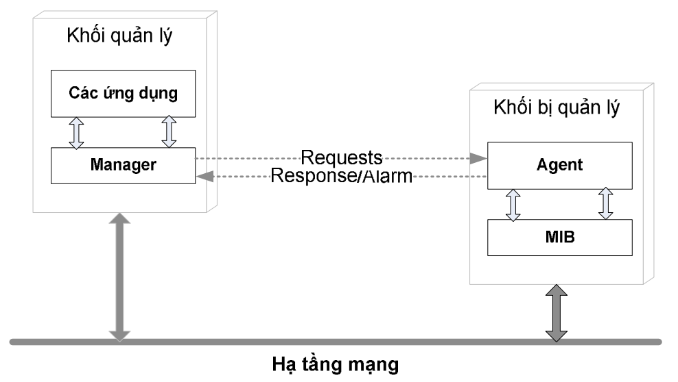

# Part I: SNMP Protocol
## Introduction

Giới thiệu 3 bài toán thuộc phổ biến nhất trong các ứng dụng của SNMP.

**1. Giám sát tài nguyên máy chủ**


Giả sử bạn có hàng ngàn máy chủ chạy các hệ điều hành (HĐH) khác nhau. Làm thế nào có thể giám sát tài nguyên (tỷ lệ chiếm dụng CPU, dung lượng còn lại của ổ cứng, tỷ lệ sử dụng bộ nhớ RAM...) của tất cả máy chủ hàng ngày, hàng giờ để kịp thời phát hiện các máy chủ sắp bị quá tải ? Bạn không thể kết nối vào từng máy để xem vì số lượng máy nhiều và vì các HĐH khác nhau có cách thức kiểm tra khác nhau.

&rarr;  Để giải quyết vấn đề này bạn có thể dùng một ứng dụng SNMP giám sát được máy chủ, nó sẽ lấy được thông tin từ nhiều HĐH khác nhau. 

> Tìm ảnh minh họa, trong thực tế dùng phần mền gì để giám sát ......tìm hiêu sau

**2. Giám sát lưu lượng trên các port của switch, router**

Bạn có hàng ngàn thiết bị mạng của nhiều hãng khác nhau, mỗi thiết bị có nhiều port. Làm thế nào để giám sát lưu lượng đang truyền qua tất cả các port của các thiết bị suốt 24/24, kịp thời phát hiện các port sắp quá tải ?
Bạn cũng không thể kết nối vào từng thiết bị để gõ lệnh lấy thông tin vì thiết bị của các hãng khác nhau có lệnh khác nhau.

&rarr;  Để giải quyết vấn đề này bạn có thể dùng một ứng dụng SNMP giám sát lưu lượng, nó sẽ lấy được thông tin lưu lượng đang truyền qua các thiết bị của nhiều hãng khác nhau. 

**3. Hệ thống tự động cảnh báo sự cố tức thời**

Bạn có hàng ngàn thiết bị mạng và chúng có thể gặp nhiều vấn đề trong quá trình hoạt động như : một port nào đó bị mất tín hiệu (port down), có ai đó đã cố kết nối (login) vào thiết bị nhưng nhập sai username và password, thiết bị vừa mới bị khởi động lại (restart), …. Làm thế nào để người quản trị biết được sự kiện khi nó vừa mới xảy ra ?

*Vấn đề này khác với hai vấn đề ở trên. Ở trên là làm thế nào cập nhật liên tục một số thông tin nào đó (biết trước sẽ lấy cái gì), còn ở đây là làm thế nào biết được cái gì xảy ra (chưa biết cái gì sẽ đến).*

&rarr;  Để giải quyết bài toán này bạn có thể dùng ứng dụng thu thập sự kiện (event) và cảnh báo (warning) bằng SNMP, nó sẽ nhận cảnh báo từ tất cả các thiết bị và hiện nó lên màn hình hoặc gửi email cho người quản trị.

### What exactly SNMP is ?
- SNMP stands for ***Simple Network Management Protocol***

>So sánh với các protocol khác, có ưu điểm gì mà lại đi dùng SNMP ?????

*Giao thức (protocol) là một tập hợp các thủ tục mà các bên tham gia cần tuân theo để có thể giao tiếp được với nhau. Trong lĩnh vực thông tin, một giao thức quy định cấu trúc, định dạng (format) của dòng dữ liệu trao đổi với nhau và quy định trình tự, thủ tục để trao đổi dòng dữ liệu đó. Nếu một bên tham gia gửi dữ liệu không đúng định dạng hoặc không theo trình tự thì các bên khác sẽ không hiểu hoặc từ chối trao đổi thông tin.*

&rarr; SNMP là một giao thức, do đó nó có những quy định riêng mà các thành phần trong mạng phải tuân theo. Một thiết bị hiểu được và hoạt động tuân theo giao thức SNMP được gọi là “có hỗ trợ SNMP” (SNMP supported) hoặc “tương thích SNMP” (SNMP compartible).

### What does SNMP use for ?

- SNMP dùng để quản lý, nghĩa là có thể theo dõi, có thể lấy thông tin, có thể được thông báo, và có thể tác động để hệ thống hoạt động như ý muốn. VD một số khả năng của phần mềm SNMP :

    + Theo dõi tốc độ đường truyền của một router, biết được tổng số byte đã truyền/nhận.

    + Lấy thông tin máy chủ đang có bao nhiêu ổ cứng, mỗi ổ cứng còn trống bao nhiêu.

    + Tự động nhận cảnh báo khi switch có một port bị down.

    + Điều khiển tắt các port trên switch.

- SNMP dùng để quản lý mạng, nghĩa là nó được thiết kế để chạy trên nền TCP/IP và quản lý các thiết bị có nối mạng TCP/IP. Các thiết bị mạng không nhất thiết phải là máy tính mà có thể là switch, router, firewall, adsl gateway, và cả một số phần mềm cho phép quản trị bằng SNMP. Không có giới hạn rằng SNMP có thể quản lý được cái gì chỉ cần có kết nối đc mạng và hỗ trợ SNMP là Oke.

- SNMP được thiết kế để có thể hoạt động độc lập với các kiến trúc và cơ chế của các thiết bị hỗ trợ SNMP. Các thiết bị khác nhau có hoạt động khác nhau nhưng đáp ứng SNMP là giống nhau, không quan trọng OS có là Windows, MacOS, ChromeOS hay Linux. 
> Tìm hiểu thêm xem các HĐH cho điện thoại có hỗ trợ SNMP không: Android, HarmonyOS, HyperOS,...
- SNMP là giao thức đơn giản, do nó được thiết kế đơn giản trong cấu trúc bản tin và thủ tục hoạt động, và còn đơn giản trong bảo mật (ngoại trừ SNMP version 3 sẽ tìm hiểu trong phần sau). Nhờ đó các phần mềm SNMP có thể được phát triển nhanh và tốn ít chi phí

### SNMP Components

Bao gồm 2 thành phần: 
- các trạm quản lý mạng: thường là 1 máy tính chạy 1 phần mền quản lý SNMP (SNMP management) 
- các thành tố mạng: máy tính, server, Firewall, các thiết bị phần cứng khác như Router, Switch,...Điểm chung của các phần cứng này là đều sẽ phải chạy một process có tên là SNMP agent để có thể giao tiếp, cung cấp thông tin với phần mềm SNMP Management chạy trong trạm quản lý mạng.


> Ảnh thực tế 1 số SNMP management, các SNMP agent trên Linux (như snmpd), trên Window,...


Hoặc theo 1 tài liệu khác thì SNMP có 3 thành phần (tính thêm cả MIB là 1 thành phần)

- a.**Bộ phận quản lý (Manager)**
Bộ phận quản lý là một chương trình vận hành trên một hoặc nhiều máy tính trạm. Qua bộ phận quản lý, những yêu cầu được chuyển tới một hoặc nhiều thiết bị chịu sự quản lý.

- **b.Agent**
Thiết bị chịu sự quản lý Agent là một nút mạng, hỗ trợ giao
thức SNMP và thuộc về mạng bị quản lý. Thiết bị có nhiệm vụ thu thập 
thông tin quản lý và lưu trữ để phục vụ cho hệ thống quản lý mạng

- **c. Cơ sở thông tin quản lý – MIB**
Trình bày trong Part 3



**Mô hình hoạt động của SNMP**
SNMP sử dụng các dịch vụ chuyển tải dữ liệu được cung cấp bởi các giao thức UDP/IP. Một ứng dụng của Manager phải nhận dạng được Agent cần thông tin với nó. Một ứng dụng của Agent được nhận dạng bởi địa chỉ IP của nó và một cổng UDP (cổng 161). Các bản tin sử dụng địa
chỉ IP và mã nhận dạng cổng UDP (cổng 162) của Manager SNMP. SNMP sử dụng 3 lệnh cơ bản là Read, Write, Trap và một số
lệnh tùy biến để quản lý thiết bị.

SNMP điều khiển, theo dõi thiết bị bằng cách thay đổi hoặc thu thập thông tin qua các biến giá trị lưu trên thiết bị. Các Agent cài đặt
trên thiết bị tương tác với những chip điều khiển hỗ trợ SNMP để đọc nội dung hoặc ghi nội dung. 
 


# Part II: Network Monitoring With SNMP

**Vậy quá trình cung cấp thông tin như đã nói ở mục trên diễn ra như thế nào**

Một thiết bị hỗ trợ SNMP có thể cung cấp nhiều thông tin khác nhau, mỗi thông tin đó được gọi là một Object. Mỗi object có một tên gọi và một mã số để nhận dạng object đó, mã số gọi là Object ID (**OID**). Các OID này có thể tuân theo quy chuẩn hoặc do từng nhà sản xuất thiết bị quy định

 Lấy ví dụ một vài OID: 
- `"1.3.6.1.2.1.1.1.0"`: This is the OID for the System Description, which typically includes details about the operating system, specific version, and hardware details.


- `"1.3.6.1.2.1.25.3.2.1.3.1"`: This is the OID for the Processor Description, which typically includes CPU details.

- `"1.3.6.1.4.1.2021.4.5.0"`: This is the OID for Total RAM.

Mỗi chữ số trong dãy số của OID đều cí ý nghĩa riêng của nó, sẽ đc tìm hiểu kỹ hơn trong phần MIB.

Để lấy một thông tin có OID đã chuẩn hóa thì SNMP application phải gửi một bản tin SNMP có chứa OID của object đó cho SNMP agent, SNMP agent khi nhận được thì nó phải trả lời bằng thông tin ứng với OID đó.

VD : Muốn lấy tên của một PC chạy Windows, tên của một PC chạy Linux hoặc tên của một router thì SNMP application chỉ cần gửi bản tin có chứa OID là 1.3.6.1.2.1.1.5.0. Khi SNMP agent chạy trên PC Windows, PC Linux hay router nhận được bản tin có chứa OID 1.3.6.1.2.1.1.5.0, agent lập tức hiểu rằng đây là bản tin hỏi sysName.0, và agent sẽ trả lời bằng tên của hệ thống. Nếu SNMP agent nhận được một OID mà nó không hiểu (không hỗ trợ) thì nó sẽ không trả lời.


**Object access**

Mỗi object có quyền truy cập là READ_ONLY hoặc READ_WRITE. Mọi object đều có thể đọc được nhưng chỉ những object có quyền READ_WRITE mới có thể thay đổi được giá trị. VD : Tên của một thiết bị (sysName) là READ_WRITE, ta có thể thay đổi tên của thiết bị thông qua giao thức SNMP. Tổng số port của thiết bị (ifNumber) là READ_ONLY, dĩ nhiên ta không thể thay đổi số port của nó.

**Diễn ra trên cổng nào**
SNMP uses both port 161 and port 162 for sending commands and messages. SNMP managers communicate with SNMP agents through designated SNMP ports. SNMP message transfers happen via the User Datagram Protocol (UDP). The Transport Layer Security (TLS) or Datagram Transport Layer Security (DTLS) protocols are sometimes used.

Here's a list of the port numbers that each protocol uses for specific processes:


Các loại tin nhắn SNMP:
Có nhiều loại thông báo SNMP khác nhau có thể được sử dụng để thiết lập giám sát mạng qua SNMP:
- GetRequest - Đây là loại tin nhắn SNMP phổ biến nhất mà trình quản lý SNMP gửi đi để yêu cầu dữ liệu. Thiết bị mục tiêu sẽ trả về giá trị được yêu cầu cùng với tin nhắn phản hồi “Response”.


- GetNextRequest - Trình quản lý SNMP có thể gửi loại tin nhắn này để khám phá thông tin nào có sẵn từ thiết bị. Bằng cách bắt đầu từ OID 0, trình quản lý có thể tiếp tục gửi yêu cầu cho dữ liệu có sẵn tiếp theo cho đến khi không còn dữ liệu “tiếp theo”. Bằng cách này, người dùng có thể khám phá tất cả dữ liệu có sẵn trên một thiết bị nhất định ngay cả khi họ có thể không có bất kỳ kiến ​​thức nào về hệ thống hoặc thiết bị phản hồi. In simple words: GET NEXT like GET, retrieves the value of the next OID in the MIB tree.

- GetBulkRequest - Được thêm vào SNMP Phiên bản 2, đây là phiên bản mới hơn, được tối ưu hóa của yêu cầu GetNextRequest. Phản hồi được trưng cầu sẽ chứa nhiều dữ liệu theo yêu cầu cho phép. Về cơ bản, đây là một cách để thực hiện một số GetNextRequests cùng một lúc, cho phép người dùng tạo danh sách tất cả dữ liệu và thông số có sẵn. In simple words This command retrieves bulk data from a large MIB table.


- SetRequest - Đây là lệnh do trình quản lý khởi xướng để đặt “Set” hoặc thay đổi “Change” giá trị của một tham số thông qua SNMP trên tác nhân thiết bị hoặc hệ thống. Loại tin nhắn này có thể được sử dụng để quản lý hoặc cập nhật cài đặt cấu hình hoặc các thông số khác. Nhưng hãy cẩn thận! Một SetRequest không chính xác có thể làm hỏng hệ thống và thiết lập mạng nghiêm trọng. Managers use the SET command to modify or assign the value on the managed device.

GET/GET NEXT/GET BULK/SET


- Response - Phản hồi là tin nhắn mà tác nhân thiết bị gửi khi có Yêu cầu “Request” từ Trình quản lý. Khi gửi phản hồi đối với yêu cầu loại GetRequest, gói tin chứa dữ liệu hoặc giá trị được yêu cầu sẽ được gửi đi. Trong trường hợp SetRequest, gói tin sẽ phản hồi với giá trị mới được thiết lập như một xác nhận rằng SetRequest đã được hoàn thành thành công.

- Trap(v2) - Một bẫy “trap” được gửi (“push out”) bởi tác nhân SNMP mà không cần trình quản lý yêu cầu. Thay vào đó, bẫy “trap” được gửi theo các điều kiện xác định, chẳng hạn như trong trường hợp có lỗi hoặc khi vượt qua ngưỡng đặt trước. Nếu người dùng muốn hưởng lợi từ các bẫy “trap” để giám sát, đây là một ý tưởng tuyệt vời về giám sát chủ động, trước tiên họ có thể phải định cấu hình các bẫy “trap” với sự trợ giúp của trình quản lý SNMP.


- InformRequest - Loại tin nhắn này đã được thêm vào SNMP v2 để cung cấp cho trình quản lý khả năng xác nhận rằng nó đã nhận được tin nhắn bẫy “trap” của tác nhân. Một số tác nhân “Agents” được cấu hình để tiếp tục gửi bẫy “trap” cho đến khi nhận được thông báo.


Report - SNMP v3 là cần thiết để sử dụng chức năng tin nhắn Báo cáo “Report”. Chúng cho phép Trình quản lý SNMP xác định loại sự cố đã được phát hiện bởi tác nhân SNMP Agent từ xa. Dựa trên lỗi được phát hiện, SNMP engine có thể cố gắng gửi một tin nhắn SNMP đã được sửa “Corrected SNMP Message”. Nếu không thể, nó có thể chuyển một dấu hiệu chỉ báo lỗi cho ứng dụng mà yêu cầu SNMP không thành công được gửi đi. [RFC3412]

# Part III: Management Information Base (MIB)

MIB (Management Information Base) là một cấu trúc dữ liệu gồm các đối tượng được quản lý (managed object), được dùng cho việc quản lý các thiết bị chạy trên nền TCP/IP. MIB là kiến trúc chung mà các giao thức quản lý trên TCP/IP nên tuân theo, trong đó có SNMP. MIB được thể hiện thành 1 file (MIB file), và có thể biểu diễn thành 1 cây (MIB tree). MIB có thể được chuẩn hóa hoặc tự tạo.

Or in simple words, MIB is a text file allow to translate numericlal OID to words, phrases human can understand


The MIB follow a tree structure. For example, this is th MIB of sys object. Each level have number, this is where the numberiacl sequence in OID comes from (we can call it by id or name)


MIB files are usually written in ASN.1 (Abstract Syntax Notation One) format and typically have the extension `.mib` or `.my`. These files define the structure of the information (objects) that can be retrieved or set via SNMP. They are used by network management systems to understand the data that devices send them. 

Here's an example of what a MIB file might look like:

```asn
MY-MIB DEFINITIONS ::= BEGIN

IMPORTS
    OBJECT-TYPE
        FROM SNMPv2-SMI
    DisplayString
        FROM SNMPv2-TC;

myDevice OBJECT IDENTIFIER ::= { enterprises 12345 }

deviceName OBJECT-TYPE
    SYNTAX      DisplayString (SIZE (0..255))
    MAX-ACCESS  read-only
    STATUS      current
    DESCRIPTION
            "The name of my device."
    ::= { myDevice 1 }

END
```

In this example, `myDevice` is an object identifier and `deviceName` is an object type that represents the name of the device. The `deviceName` object is read-only, meaning it can be retrieved but not changed via SNMP.

OR

SMI mô tả các đối tượng bị quản lý thông qua ngôn ngữ mô tả
ASN.1. Việc định nghĩa đối tượng gồm các trường:
- Đối tượng (Object): Tên của đối tượng, còn được coi như là
phần mô tả đối tượng cho mỗi loại đối tượng cùng với phần nhận dạng
đối tượng tương ứng của đối tượng.
- Cú pháp (Syntax): Cú pháp cho loại đối tượng. Đó có thể là
một trong các loại cú pháp đơn giản như: Integer, Octet String, Object
Identifier, Null hay một cú pháp ứng dụng như: Địa chỉ mạng, bộ đếm,
kiểu Gause, Time Ticks, dạng dữ liệu không trong suốt, hay các loại dữ
liệu ứng dụng mở rộng.
- Định nghĩa (Definition): Các định nghĩa mô tả ngữ nghĩa của
loại đối tượng. 
- Truy nhập (Access): Phương pháp truy nhập có thể là: chỉ
đọc, đọc-ghi hay không thể truy nhập.
- Trạng thái (Status): Có thể là cưỡng chế, tùy chọn hay không
còn hiệu lực.

Ví dụ: Định nghĩa một đối tượng sysUpTime trong MIB-II 


**Phân Tích Cụ Thể Hơn Cấu Trúc Của Cây MIB**


Nút gốc của cây phân trong MIB không có tên. Dưới gốc là 3 cây con gồm:
- **Ccitt(0)**: do CCITT quản lý (Consultative Committee for
International Telephone and Telegraph).
- **Iso(1)**: do tổ chức ISO quản lý (International Organization
for Standardization).

    Dưới nhánh iso(1), tổ chức ISO thiết kế một nhánh dành cho
các tổ chức khác là org(3). Dưới org(3) có nhiều nhánh con, một nhánh
được dành riêng cho Bộ Quốc phòng Mỹ, dod(6), dưới dod(6) có một
nhánh dành cho cộng đồng internet ngày nay, là nhánh internet(1). Tất 
cả mọi thứ thuộc về cộng đồng Internet đều nằm dưới
.iso.org.dod.internet, mọi object của các thiết bị TCP/IP đều bắt đầu với
prefix .1.3.6.1 (dấu chấm đầu tiên biểu diễn rằng .iso là cây con của
gốc, và gốc thì không có tên).

    Với mục tiêu quản lý các nhóm giao thức trong mô hình
TCP/IP và mạng Internet, thì nhánh Internet được chia ra thành 4 nhóm
lớn: Thư mục, quản lý, thử nghiệm và nhóm riêng: 
    - Nhóm thư mục: Hỗ trợ các thư mục trong OSI X.500
    - Nhóm quản lý: Gồm các đối tượng của Internet còn gọi là
cây MIB-II (RFC1213)
    - Nhóm thử nghiệm: Sử dụng cho quá trình thử nghiệm trước
khi chuyển sang nhóm quản lý.
    - Nhóm riêng: Gồm các đặc tả của các nhà cung cấp thiết bị và
các vùng gia tăng giá trị. 
    

    Theo hướng nhóm quản lý, MIB-II đưa ra các biến số để quản
lý gồm 11 cây chức năng con được chỉ ra trên hình 1.11. Các cây con
này lại tiếp tục được chia ra thành các cây con cấp thấp hơn như đối
tượng hệ thống và các bảng con tương ứng với các lá. Lá được sử dụng
để đánh dấu các biến số bị quản lý thuộc một loại nhất định. Một số lá 
như mô tả hệ thống sysDesc chỉ ghi nhận một giá trị của biến số bị
quản lý và chỉ đòi hỏi một phần tử lưu trữ duy nhất. Những lá khác, ví
dụ như mô tả trạng thái kết nối TCP tcpConnState có thể cần ghi nhận
kết nối xẩy ra ở nhiều thời điểm khác nhau. Các thời điểm khác nhau
này sẽ được tổ chức thành các cột, các cột này tạo thành một bảng mà
các hàng của bảng này biểu diễn các thông số của một thực thể ở
những thời điểm khác nhau.
    

- **iso-ccitt(2)**: do cả ISO và CCITT quản lý.


> Chưa hiểu đoạn dưới này lắm

Cụ thể hơn nữa về MIB-II: phân tách đối tượng quản lý thành 11 nhóm đối tượng. Cụ thể hơn về từng nhóm đối tượng: 
- **a. Nhóm hệ thống 1.3.6.1.2.1.1**: Nhóm hệ thống mô tả tổng quan về hệ thống bị quản lý dưới dạng văn bản ký tự ASCII. Bao gồm nhận dạng đối tượng, độ dài thời
gian từ thời điểm tái khởi động thực thể quản lý mạng và những chi tiết
quản lý khác. 
- **b. Nhóm giao diện 1.3.6.1.2.1.2**: Nhóm giao diện gồm 23 nhận dạng đối tượng cung cấp các thông tin như: hiệu năng, cấu hình và trạng thái cho tất cả các loại giao diện.
- **c.Nhóm biên dịch địa chỉ 1.3.6.1.2.1.3**: Nhóm phiên dịch địa chỉ cung cấp một bảng để phiên dịch giữa địa chỉ IP và địa chỉ (phần cứng) vật lý.
- **d. Nhóm giao thức internet IP 1.3.6.1.2.1.4**: Nhóm giao thức IP chứa các đối tượng bị quản lý cung cấp chức năng về phân hệ IP của một node.
- **e.Nhóm giao thức bản tin điều khiển internetICMP 1.3.6.1.2.1.5**: Nhóm giao thức bản tin điều khiển Internet là thành phần bắtbuộc của IP và được định nghĩa trong RFC 792. Nhóm ICMP cung cấp các bản tin điều khiển nội mạng và thực hiện nhiều vận hành ICMP
trong thực thể bị quản lý.
- **f.Nhóm giao thức TCP 1.3.6.1.2.1.6** Nhóm giao thức điều khiển truyền tải là bắt buộc và cung cấp thông tin liên quan tới vận hành và kết nối TCP.
- **g.Nhóm giao thức UDP 1.3.6.1.2.1.7** Nhóm giao thức dữ liệu đồ người sử dụng là bắt buộc và cung cấp thông tin liên quan tới hoạt động UDP.
- **h.Nhóm giao thức cổng ngoài 1.3.6.1.2.1.8** Nhóm giao thức cổng ngoài là bắt buộc với mọi hệ thống có triển khai EGP. EGP truyền đạt thông tin giữa các hệ thống tự trị
(autonomous systems), và được mô tả chi tiết trong RFC904.
- **i. Nhóm CMOT 1.3.6.1.2.1.9**: Hiện tại, RFC 1214 được xếp loại là giao thức “quá khứ”.
- **j. Nhóm truyền dẫn 1.3.6.1.2.1.10**: Nhóm truyền dẫn chứa các đối tượng liên quan đến việc truyền dẫn dữ liệu. RFC 1213 không định nghĩa những đối tượng này rõ ràng. 
- **k.Nhóm giao thức SNMP**: Nhóm SNMP cung cấp thông tin về các đối tượng SNMP. 


 
# Part IV: SNMP versions


Các phiên bản của SNMP

SNMP có 3 phiên bản : **SNMPv1**, **SNMPv2c**, và **SNMPv3**. Các phiên bản này khác nhau một chút ở định dạng bản tin và phương thức hoạt động. 

*Hiện tại SNMPv1 là phổ biến nhất do có nhiều thiết bị tương thích nhất và có nhiều phần mềm hỗ trợ nhất. Trong khi đó chỉ có một số thiết bị và phần mềm hỗ trợ SNMPv3.*

- SNMPv1
    
    The original version of SNMP, referred to as SNMPv1, has critical security and performance limitations. SNMPv1 provides authentication, which is based on a password (community string). The community string is sent in clear text between the NMS manager and the agents. Therefore, the managed device is vulnerable to unauthorized users who can easily reconfigure the device, especially if IP access control lists (ACLs) are not in place. The SNMPv1 and 2c data exchanged between the NMS administrator and the agents are not encrypted. 

    Regarding SNMPv1 protocol performance, the set of protocol transactions is limited to Gets, Sets, and Traps of individual objects in the MIB. Therefore, large sets of information require several transactions to retrieve a row of information.

- SNMPv2c 

    SNMPv2c is the successor to the original SNMPv1. The standard MIB2 integer is 32 bits long in the case of SNMPv1; SNMPv2 defines a new type of integer that is 64 bits long. A 64-bit counter can better handle high-speed interfaces because 32-bit counters do not provide enough capacity and must wrap quickly. This increases network traffic and has a negative impact on both the agent and the NMS manager CPU utilization.

    SNMPv2c also improves the performance of SNMPv1 by introducing the Get Bulk Requests operation. If the NMS manager wants to retrieve a large amount of data, it sends a GetBulk message to the agent instead of a Get request. The GetBulk operation provides values for all variables in the list and is much more efficient than sending repetitive GetNext commands.

    SNMpv2c introduces a new type of SNMP communication – SNMP Inform request. Typically, an SNMP Inform is used for manager-to-manager communication to acknowledge receipt of notification. The SNMP inform request packet will be sent continually until the sending SNMP manager receives an SNMP acknowledgment.

    Both SNMPv2c and SNMPv1 protocols use simple authentication, which relies on community names.

    SNMP v2 hỗ trợ bộ đếm 64 bit nhưng vẫn gửi dữ liệu quan trọng dưới dạng văn bản (Text), vì vậy nó không thực sự tăng cường bảo mật. Và nếu người dùng bắt gặp SNMP v2, đó hầu hết là "SNMP v2c" mà các nhà sản xuất hoặc nhà mạng đang nói đến, với chữ "c" là viết tắt của từ "cộng đồng - Community". Hai phiên bản SNMP v2 khác tồn tại, SNMP v2p và SNMP v2u, nhưng chúng chỉ được triển khai trong một số trường hợp hiếm hoi


    SNMPv2u is a user-based security model, as specified in RFC 1909 and RFC 1910.
    SNMPv2c is a common community-based security model.
    SNMP 2u offers per-user authentication, similar to SNMPv3. SNMPv2u never really took off in the wild; anyone who wants per-user authentication uses SNMPv3. For more details (and there are a lot), consider this article in the Simple Times.

- SNMPv3

    SNMPv3 is the latest SNMP protocol that addresses the security issues introduced by older SNMP versions. SNMpv3 provides message integrity, authentication, and encryption by implementing SNMP View, SNMP Group, and SNMP User.

    SNMP View defines what a particular SNMpv3 user can view. For example, it is possible to configure that a user will only have access to view the interface index, OID 1.3.6.1.2.1.2, and anything below that.
    To create an all-access View the name iso should be specified. The MIB has a tree structure so anything below the iso can be accessed (Figure 2).

    SNMP Group is associated with the SNMP View and it defines a type of the access – read-only or read/write. It also defines the type of security that is active when interacting with the device.

    - noauth – nor authentication or encryption

   - auth – only authentication, no encryption

   - priv – authentication and encryption

SNMP User is added to the group with the level of authentication and encryption. The security model must match the group, e.g. priv, a type of the hash for the password (e.g. SHA), the password, encryption algorithm (e.g. AES), and a shared secret for generating encryption keys.

Some avaiable commands in each SNMP version


**Can SNMPv2 and SNMPv3 coexist?**
Yes, SNMPv2 and SNMPv3 can coexist. In a typical management scenario, the network management system communicates with SNMP agents of different versions. A multilingual agent, which supports all three versions, can coexist with agents that support only a single version. This is defined in RFC 25.

This coexistence is more commonly used while migrating from SNMPv2 to SNMPv3. Once migrated, it is recommended to disable the older versions.


# Part V: Programming


# Ref:

https://www.site24x7.com/network/what-is-snmp.html

https://mdungblog.wordpress.com/2020/01/06/ly-thuyet-giao-thuc-snmp-toan-tap/

http://tailieuso.udn.vn/bitstream/TTHL_125/4920/3/Tomtat.pdf

https://www.noction.com/blog/snmp-versions-evolution-security

https://licensesoft.vn/snmp-la-gi.htm