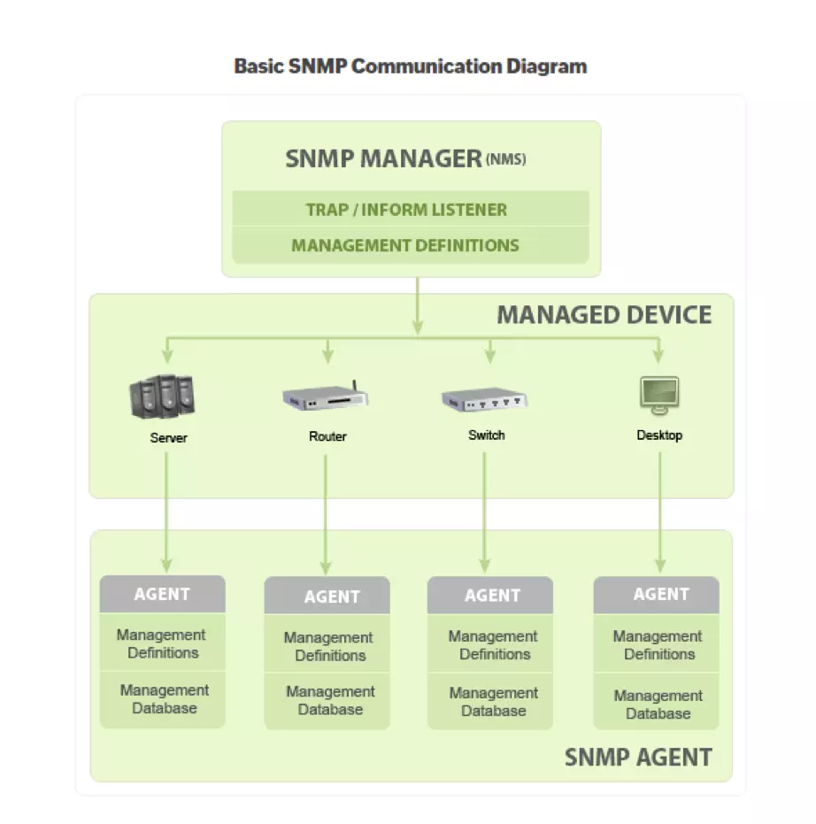

## What is SNMP

- SNMP stands for ***Simple Network Management Protocol***
- Developed to allow administrators to monitor network state and remotely modify setting, congiuration on network equiments like: switcher, routers, server, printers, uninteruptible power supplies things
-  Three version: 1, 2c, 3. Version 1,2c : no username, only require "community string" and no encryption support, version 3 require username and password, also support encryption


## Structure of  a SNMP device:

A devide that has SNMP is enable is called as an **agent** (EX: A router with SNMP enable). An agent can have many objects/sensors it can interact with. Some objects are part of an industry standard and some will be vendor-specific for this device. (In that case, information about these object should be found on vendors website)


For example, this agent has some objects like Name, uptime, interfaces, rounting table. Each object is assigned to an **OID** (OID is a sequence of number, look something similar to IP address, Ex: 1.3.6.1.2.1.2.2.1.8, use to indentify objects). These OID with their human-readable name is store in a text file **MIB**. (MIB stands for Management Information Base: a text file allow to translate numericlal OID to words, phrases human can understand)


The MIB follow a tree structure. For example, this is th MIB of sys object. Each level have number, this is where the numberiacl sequence in OID comes from


Refer: https://www.youtube.com/watch?v=2IXP0TkwNJU and https://www.youtube.com/watch?v=Lq7j-QipNrI


## Structure of  SNMP:
Refer: https://vietnix.vn/snmp-la-gi/

Các thành phần của SNMP

#### 1. SNMP Manager 

Network Management System (**NMS**): Trình quản lý hoặc hệ thống quản lý là một thực thể riêng biệt có trách nhiệm giao tiếp với các thiết bị mạng được triển khai SNMP agent. Đây thường là một máy tính được sử dụng để chạy một hoặc nhiều hệ thống quản lý mạng.

Các chức năng chính của SNMP manager:
- Agent truy vấn
- Nhận response từ các agent
- Đặt các biến trong agent
- Xác nhận các sự kiện không đồng bộ từ các agent

#### 2. Các thiết bị được SNMP quản lý

Thiết bị được quản lý hoặc phần tử mạng là một phần của mạng yêu cầu một số hình thức giám sát và quản lý, ví dụ: router, switches, server, máy trạm, máy in, UPS, v.v.

#### 3. SNMP Agent
Agent là một chương trình được đóng gói trong các thiết bị mạng. Việc kích hoạt agent cho phép nó thu thập cơ sở dữ liệu thông tin quản lý từ thiết bị cục bộ và cung cấp nó cho SNMP manager khi được truy vấn. Các agent này có thể là tiêu chuẩn (ví dụ: Net-SNMP) hoặc cụ thể cho một nhà cung cấp (ví dụ: HP insight agent).

Các chức năng chính của SNMP agent:

- Thu thập thông tin quản lý về các chỉ số hoạt động cuả thiết bị
- Lưu trữ và truy xuất thông tin quản lý như được định nghĩa trong MIB.
- Báo hiệu sự kiện cho trình quản lý.
- Hoạt động như một proxy cho một số nút mạng không quản lý được – SNMP.

## How SNMP works
NMS (A pice of software that can communicate with the SNMP agents). There are few ways the NMS can speak to the agent:


These command can be devide as follow:
-   Polling: when NMS actively requests information from the agent, then device respone info to the network monitor. All these actions happend on port 161 UDP
    - **Get** require: include Get, GetNext, GetBulk. 

        Để nhận thông tin trạng thái từ agent, manager có thể đưa ra message Get và GetNext để yêu cầu thông tin cho một biến cụ thể. Sau khi nhận được message Get hoặc GetNext, agent sẽ gửi message **GetResponse** cho manager. Nó sẽ chứa thông tin được yêu cầu hoặc lỗi giải thích tại sao không thể xử lý request.
    - **Set** require: Message SET cho phép manager yêu cầu thực hiện thay đổi đối giá trị của một object trong agent. Sau đó, agent sẽ trả lời bằng message Set-response nếu thay đổi đã được thực hiện hoặc lỗi giải thích tại sao không thể thực hiện thay đổi.


- Notifying: agents actively communication back to NMS event without request from NMS. These are useful for monitoring critical events, errors. All these action happend in port 162 UDP

    - **TRAP**: Message TRAP được khởi xướng bởi agent và gửi đến manager khi một sự kiện quan trọng xảy ra. Trap dùng để cảnh báo cho manager – thay vì đợi request trạng thái từ manager khi cần thăm dò ý kiến ​​của agent.
    - **INFORM**: Message INFORM rất giống với TRAP, nhưng chúng đáng tin cậy hơn. Các message INFORM được khởi tạo bởi agent và khi manager nhận được nó, nó sẽ gửi response đến agent cho biết message đã được nhận. Nếu agent không nhận được response từ manager thì agent sẽ gửi lại message INFORM.

        An Inform message will wait for acknowladgament from NMS, if it does not recieve one it will resend the Inform. A Trap is on the othterhand, send and then forgotten


- **SNMPWALK**: Nhận tất cả dữ liệu

    SNMPWALK sử dụng nhiều request Get-Next để truy xuất toàn bộ cây dữ liệu mạng từ một đối tượng được quản lý. Công cụ iReasoning MIB Browser sẽ rất hữu ích để xem tất cả các OID mà một agent cung cấp.


## Get IP address of connected router

Use:
```bash
ip route | grep default
#default via .... proto dhcp metric 600 
```
or 
```bash
route -n
```

But my Viettel modern does not support SNMP :((
## Run NMS on Linux host and SNMP Agent on Linux virtual machine
Install KVM: https://phoenixnap.com/kb/ubuntu-install-kvm
In this, I test on Linux Mint Xfce 23.1

Get the IP address of virtual machine using:
```bash
hostname -I
#192.168.122.133 
```

Set up the SNMP on host and virtual machine:
Refer: https://www.digitalocean.com/community/tutorials/how-to-install-and-configure-an-snmp-daemon-and-client-on-ubuntu-18-04

I find add new user by this way is easier, just using this command in refer https://checkmk.com/blog/how-configure-snmp-linux :
```bash
net-snmp-create-v3-user
```
Here is my config in agent side (in /etc/snmp/snmpd.conf): 
```plaintext
###########################################################################
#
# snmpd.conf
# An example configuration file for configuring the Net-SNMP agent ('snmpd')
# See snmpd.conf(5) man page for details
#
###########################################################################
# SECTION: System Information Setup
#

# syslocation: The [typically physical] location of the system.
#   Note that setting this value here means that when trying to
#   perform an snmp SET operation to the sysLocation.0 variable will make
#   the agent return the "notWritable" error code.  IE, including
#   this token in the snmpd.conf file will disable write access to
#   the variable.
#   arguments:  location_string
sysLocation    Sitting on the Dock of the Bay
sysContact     Me <me@example.org>

# sysservices: The proper value for the sysServices object.
#   arguments:  sysservices_number
sysServices    72


###########################################################################
# SECTION: Agent Operating Mode
#
#   This section defines how the agent will operate when it
#   is running.

# master: Should the agent operate as a master agent or not.
#   Currently, the only supported master agent type for this token
#   is "agentx".
#   
#   arguments: (on|yes|agentx|all|off|no)

master  agentx

# agentaddress: The IP address and port number that the agent will listen on.
#   By default the agent listens to any and all traffic from any
#   interface on the default SNMP port (161).  This allows you to
#   specify which address, interface, transport type and port(s) that you
#   want the agent to listen on.  Multiple definitions of this token
#   are concatenated together (using ':'s).
#   arguments: [transport:]port[@interface/address],...

#agentaddress  127.0.0.1,[::1]
agentAddress udp:161,udp6:[::1]:161


###########################################################################
# SECTION: Access Control Setup
#
#   This section defines who is allowed to talk to your running
#   snmp agent.

# Views 
#   arguments viewname included [oid]

#  system + hrSystem groups only
view   systemonly  included   .1.3.6.1.2.1.1
view   systemonly  included   .1.3.6.1.2.1.25.1


# rocommunity: a SNMPv1/SNMPv2c read-only access community name
#   arguments:  community [default|hostname|network/bits] [oid | -V view]

# Read-only access to everyone to the systemonly view
rocommunity  public default -V systemonly
rocommunity6 public default -V systemonly

# SNMPv3 doesn't use communities, but users with (optionally) an
# authentication and encryption string. This user needs to be created
# with what they can view with rouser/rwuser lines in this file.
#
# createUser username (MD5|SHA|SHA-512|SHA-384|SHA-256|SHA-224) authpassphrase [DES|AES] [privpassphrase]
# e.g.
# createuser authPrivUser SHA-512 myauthphrase AES myprivphrase
#
# This should be put into /var/lib/snmp/snmpd.conf 
#
# rouser: a SNMPv3 read-only access username
#    arguments: username [noauth|auth|priv [OID | -V VIEW [CONTEXT]]]
rouser authPrivUser authpriv -V systemonly

# include a all *.conf files in a directory
includeDir /etc/snmp/snmpd.conf.d
```

And the NMS side (in /etc/snmp/snmp.conf): *note that snmp.conf is for NMS, snmpd.conf is for agent* 

```plaintext
# As the snmp packages come without MIB files due to license reasons, loading
# of MIBs is disabled by default. If you added the MIBs you can reenable
# loading them by commenting out the following line.
#mibs :

# If you want to globally change where snmp libraries, commands and daemons
# look for MIBS, change the line below. Note you can set this for individual
# tools with the -M option or MIBDIRS environment variable.
#
# mibdirs /usr/share/snmp/mibs:/usr/share/snmp/mibs/iana:/usr/share/snmp/mibs/ietf
```

After do all things above, send a **GET** request from NMS side to the virtual machine:
```bash
snmpget -u ctav3 -l authPriv -a MD5 -x DES -A chutrunganh -X chutrunganh 192.168.122.133 1.3.6.1.2.1.1.1.0
```
The output should be: 
```plaintext
SNMPv2-MIB::sysDescr.0 = STRING: Linux KVM-CTA 5.15.0-91-generic #101-Ubuntu SMP Tue Nov 14 13:30:08 UTC 2023 x86_64
```

## Test SNMP in Python
Refer: https://www.javatpoint.com/snmp-module-in-python
1. Download SNMP module for python:
```bash
pip install pysnmp  
```
2. Uderstand the Get operation

The Get operation of SNMP enables us to retrieve the value of an individual object in the MIB

- For SNMP version3, which require credentials (username and password)

```python
from pysnmp.hlapi import *

# For SNMP v3
from pysnmp.hlapi import *

def get(target_ip, oids, credentials, port=161):
    errorIndication, errorStatus, errorIndex, varBinds = next(
        getCmd(SnmpEngine(),
               credentials,
               UdpTransportTarget((target_ip, port)),
               ContextData(),
               *([ObjectType(ObjectIdentity(oid)) for oid in oids])
        )
    )
    
    if errorIndication:
        print(f"Error: {errorIndication}")
    elif errorStatus:
        print(f"Error: {errorStatus} at {errorIndex}")
    else:
        for varBind in varBinds:
            print(f"{varBind.prettyPrint()}")

# Define SNMPv3 credentials
credentials = UsmUserData(
    'ctav3',         # SNMPv3 username (configured on SNMP agent)
    'chutrunganh',   # Authentication password
    'chutrunganh',   # Privacy password
    authProtocol=usmHMACMD5AuthProtocol,   # Authentication protocol (MD5)
    privProtocol=usmDESPrivProtocol        # Privacy protocol (DES)
)

# Specify target IP address and OID
target_ip = "192.168.122.133"
oid = "1.3.6.1.2.1.1.1.0"  # System description OID

# Call the get() function to retrieve SNMP data using SNMPv3
get(target_ip, [oid], credentials)

```

- For SNMP version 2, which require "communication string". In the /etc/snmp/snmpd.conf, the communication string is set as "public" (by default) 

```python
from pysnmp.hlapi import *

# Define the get() function for SNMPv2
def get(target, oids, community_string, port=161):
    errorIndication, errorStatus, errorIndex, varBinds = next(
        getCmd(SnmpEngine(),
               CommunityData(community_string),
               UdpTransportTarget((target, port)),
               ContextData(),
               *[ObjectType(ObjectIdentity(oid)) for oid in oids])
    )
    
    if errorIndication:
        print(f"Error: {errorIndication}")
    elif errorStatus:
        print(f"Error: {errorStatus} at {errorIndex}")
    else:
        for varBind in varBinds:
            print(f"{varBind.prettyPrint()}")

# Specify target IP address
target_ip = '192.168.122.133'  # Change to the IP address of your SNMP agent

# Specify OID(s) you want to retrieve
oids = ['1.3.6.1.2.1.1.1.0']  # Example OID for system description

# Specify SNMPv2 community string
community_string = 'public'  # Change to your SNMPv2 community string

# Call the get() function to retrieve SNMP data
get(target_ip, oids, community_string)


```
#### Explain parameters
Function get() requires:
- **target** : Represents the IP address or hostname of the device from which you want to retrieve SNMP information

- **oids**: Represents the list of SNMP Object Identifiers (OIDs) that specify the information you want to retrieve.
- **credentials**: Represents the SNMP credentials (e.g. community string in SNMP version 1,2c or username/password in version 3) required to authenticate with the device.
- **port**: Represents the UDP port number (default is 161, the standard SNMP port).

- **engine**: Represents the SNMP engine used for communication (default is an instance of hlapi.SnmpEngine()).
    
    - *What this parameter "engine" use for? -> Represents the core component responsible for managing SNMP operations Like:*
        - Message Processing: Handles the encoding, decoding, and validation of SNMP messages.
        - Security Configuration: Manages SNMP security features like authentication and encryption settings.
        - Transport Layer Interaction: Communicates with transport protocols (e.g., UDP, TCP) for sending and receiving SNMP messages.
        - Session Management: Maintains the state and lifecycle of SNMP sessions and associated resources.

- **context**: (Phần này chưa hiểu lắm) The context parameter in SNMP, specifically hlapi.ContextData(), is used to define the context in which an SNMP operation is performed. In the context of the PySNMP high-level API (hlapi), ContextData() is an object that represents SNMP context information, which includes both the contextEngineId and the contextName. The contextName and contextEngineID parameters allow multiple versions of the same MIB objects to be made available by a single SNMPv3 engine, as if you have multiple agents running on the same IP address and port. These are distinguished from one another by contextName and contextEngineID, where otherwise they would have had a different address and/or port. 
Refer: https://stackoverflow.com/questions/32132365/significance-of-context-name-in-snmpv3

#### Explain the operation inside the function

- hlapi.getCmd: This function is used to create an SNMP GET command handler.
- engine: The SNMP engine object used for sending the command.
- credentials: The SNMP credentials object used for authentication.
- hlapi.UdpTransportTarget((target, port)): Creates a UDP transport target using the specified target (IP address or hostname) and port.
- context: The SNMP context data used for the operation.
- *construct_object_types(oids): This line calls a function construct_object_types() with oids as arguments to construct a list of SNMP Object Types for the SNMP GET operation.

- fetch(handler, 1): This part of the line calls a function named fetch() with two arguments:
    - handler: Represents the SNMP command handler generated by hlapi.getCmd(). This handler encapsulates the SNMP operation to retrieve information from a device.
    - 1: Indicates the maximum number of results to fetch. In this case, 1 means fetching only one result.
    
    After calling fetch(handler, 1), the [0] indexing is used to extract the first (and presumably only) result from the fetched data.

