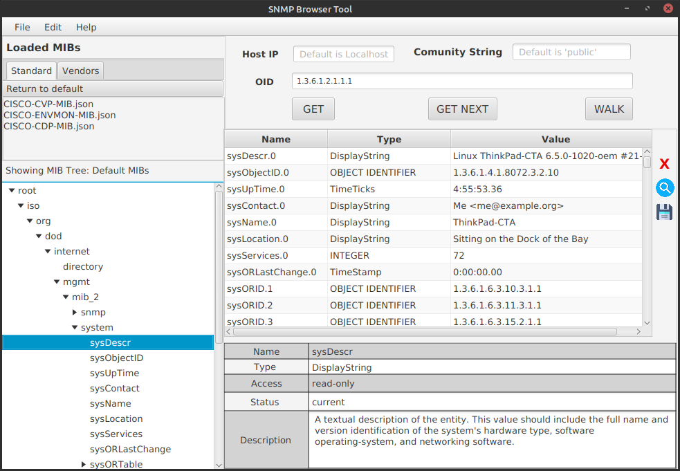
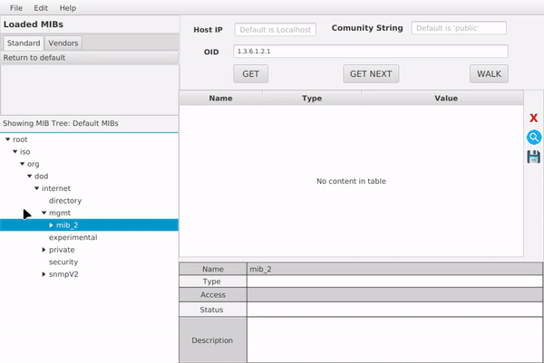
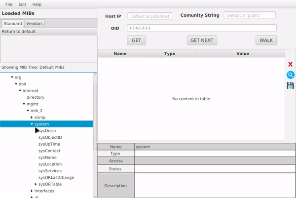
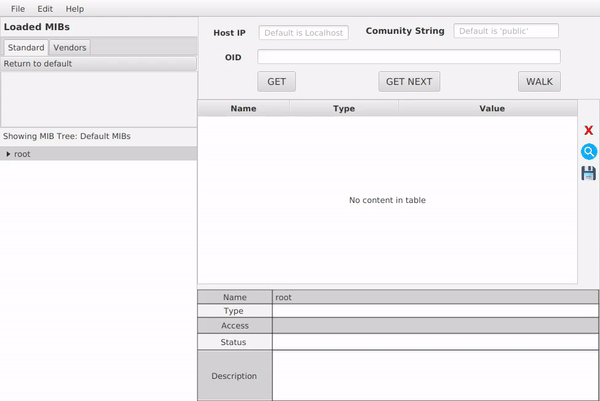
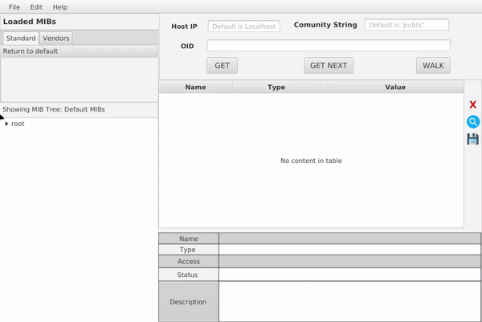
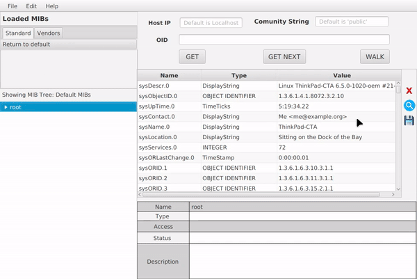

<p align="center">

[](https://git.io/typing-svg)

</p>

<p align="center">
  
</p>


<div align="center">

# Collect SNMP Data From Server And Network Devices

</div>

<p>  </p>

<div align="center"> 

[](https://opensource.org/licenses/MIT)


</div>


 
<!-- Screenshot of the app -->
<p align="center">
  
</p>


<p> </p>

# Overview 📝
This SNMP Browser is a simple Java-based application designed to collect SNMP data 
from network devices. It allows users to perform SNMP operations such as 
GET, GETNEXT, and WALK requests, and then parse the raw data into a more readable format, 
displaying it using JavaFX. The primary aim is to manage and monitor network devices in the simplest way.

This application was developed as part of the Course Project 1 for the semester 20232 at [SOICT HUST](https://soict.hust.edu.vn/)

# Installation ⚒️

There are several ways you can try our application:

1. **Download the JAR file (Recommended)**: Download directly from the [Releases page](https://github.com/chutrunganh/Project-I-Collect-SNMP-Data/releases/tag/v1.1.2). Ensure you run the app with Java 21.

2. **Build from Source**: Follow the instructions to build the project from [source](https://github.com/chutrunganh/Project-I-Collect-SNMP-Data/edit/master/README.md#build-from-source).

3. **Using Docker (Experimental)**: Note that this method is not fully functional due to configuration issues.
In this Docker version, MIB viewing works. However, SNMP requests are non-functional because I couldn't configure the application to reach the outside network. To try the application, execute the following command to pull and run the Docker image:
```bash
docker run -p 5900:5900 chutrunganh/snmp_browser:1.1.2
```
Then, use a VNC viewer (e.g TigerVNC Viewer) to access the application GUI on localhost:5900


### Build from source
1. Clone the repository
```bash
git clone https://github.com/chutrunganh/Project-I-Collect-SNMP-Data.git
```
2. Install dependencies

- Ensure you have Java SDK (version 21.0.3 or later) and JavaFX installed to run the application.
  Use the following VM options to run the 
  application:  ```--module-path Path_To_JavaFX/lib --add-modules javafx.controls,javafx.fxml```.
  
  
- Additional dependencies:
  - fasterxml.jackson.core.databind for reading JSON files
  - snmp4j for SNMP operations
  - pysnmp-pysmi for converting .mib files to JSON (only needed if you intend to recompile MIB files)

All dependencies are included in the `pom.xml` file. You can install them automatically using Maven.


3. Run the application

Run the `Main.java` in the `src/main/java/Main.java` directory to start the application.

 
# Feature🕹️

- Perform SNMP operations (currently supports only GET, GETNEXT, WALK).
    - **GET**: Retrieve the value of a single OID.
  
      
  
    - **GETNEXT**: Retrieve the value of the next OID in the MIB tree.
     
        
  
    - **WALK**: Retrieve the values of all OIDs in the MIB subtree.
  
        

          


- View MIB files in hierarchy structure (currently supports only .json files; if you have .mib 
files, you can convert them using the provided script. There are over 70 MIB files already 
available in the `MIB Databases` directory, or users can import their own MIB files.
      
     


- Display formatted results, with options to search and save these results to a file.
      
     


# Code Structure 🏗️
We designed our code following the Maven standard structure and the Model-View-Controller (MVC) pattern. Here is the 
main structure and their short purpose:
```
Project-I-Collect-SNMP-Data/
  └── src/
    ├── main/
    │   ├── java/
    │   │   ├── Control/
    │   │   │   ├── MainController.java
    │   │   │   └── ARowInQueryTable.java  # Used to define a row structure in the query table
    │   │   └── Model/
    │   │       ├── MIBTreeStructure/
    │   │       │   ├── Node.java  # Used to define a node in the MIB tree
    │   │       │   ├── BuildMIBTree.java  # Used to build the MIB tree from the JSON file
    │   │       │   ├── MibRootOidFinder.java  # Used to find the root OID of a MIB file
    │   │       │   └── MibLoader.java  # Used to load MIB files for GET NEXT and Walk
    │   │       └── SNMPRequest/
    │   │           ├── SNMPGet.java
    │   │           ├── SNMPGetNext.java
    │   │           ├── SNMPWalk.java
    │   │           └── SnmpResponseFormat.java  # Used to format the raw data to a more readable format
    │   └── resources/
    │       ├── Images/
    │       ├── styles.css # Use to render the Dark Mode
    │       └── View/  # Contains the FXML files for the GUI
    │
    │
    └── test/java/TestFiles  # Contains test files for individual functions of the project
```

The project also incorporates the following components:  
- `MIB Databases` directory: This directory houses the MIB files that the application utilizes to 
gather information. The MIB files are in JSON format.


- `GetJSONFiles` script: This script is employed to transform MIB ASN1 files into JSON format files. 
If you wish to recompile the MIB files, adjust the `MIB_DIR` and `DES_DIR` variables in the script to match your case.


- `Docs` directory: contains all the documents related to the project, including the project report, SNMP Configuration and the project structure diagram in Astah UML file.


# License 📜
Distribution of this project is under the MIT License. 
See [LICENSE](https://github.com/chutrunganh/Project_I_Collect_SNMP_Data?tab=MIT-1-ov-file) for more information.

# Documentation 📚
For more details about both SNMP theory and our application, you can check our [Project Report](https://github.com/chutrunganh/Project-I-Collect-SNMP-Data/blob/master/Docs/Project_I_Report.pdf).

# Contact 📧
This project is maintained by: Chu Trung Anh - [Email](mailto:chutrunganh04@gmail.com).

Feel free to contact me if you have any question or suggestion.
