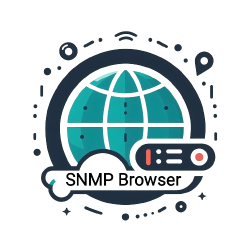

<p align="center">
  
</p>


<div align="center">

# Collect SNMP Data From Server And Network Devices

</div>

<p>  </p>

<div align="center"> 

[](https://opensource.org/licenses/MIT)


</div>


 
<!-- Screenshot of the app -->
<p align="center">
  
</p>


<p> </p>

# Overview 📝
This SNMP Browser is a simple Java-based application designed to collect SNMP data 
from network devices. It allows users to perform SNMP operations such as 
GET, GETNEXT, and WALK requests, and then parse the raw data into a more readable format, 
displaying it using JavaFX. The primary aim is to manage and monitor network devices i
n the simplest way.

This application was developed as part of the Course Project 1 for the semester 20232 at [SOICT HUST](https://soict.hust.edu.vn/)

# Installation ⚒️
1. Clone the repository
```bash
git clone https://github.com/chutrunganh/Project_I_Collect_SNMP_Data.git
```
2. Install dependencies

- Ensure you have Java SDK (version 17 or later) and JavaFX installed to run the application.
  Use the following VM options to run the 
  application:  ```--module-path Path_To_JavaFX/lib --add-modules javafx.controls,javafx.fxml```.
  Also, ensure to mark the `src `directory as the Sources Root in your IDE, as it relates to some paths used in the project.


- Additional dependencies:
  - fasterxml.jackson.core.databind for reading JSON files
  - snmp4j for SNMP operations
  - pysnmp-pysmi for converting .mib files to JSON (only needed if you intend to recompile MIB files)


 
# Feature🕹️

- Perform SNMP operations (currently supports only GET, GETNEXT, WALK).


- View MIB files in hierarchy structure (currently supports only .json files; if you have .mib 
files, you can convert them using the provided script. There are over 70 MIB files already 
available in the `MIB Databases` directory, or users can import their own MIB files.


- Display formatted results, with options to search and save these results to a file.

For more details, you can check our Use Case diagram.

# Code Structure 🏗️
We designed our code following the Model-View-Controller (MVC) pattern. Here is the 
main structure and their short purpose:
```
Project_I_code/
├── src/
│   ├── View/
│   │   └── MainUI.fxml
│   ├── Control/
│   │   ├── MainController.java
│   │   └── ARowInQuery.java  # Used to define a row structure in the query table
│   └── Model/
│       ├── MIBTreeStructure/
│       │   ├── Node.java  # Used to define a node in the MIB tree
│       │   ├── BuildMIBTree.java  # Used to build the MIB tree from the JSON file
│       │   └── MibLoader.java  # Used to load the MIB file for GET NEXT and Walk
│       └── SNMPRequest/
│           ├── SNMPGet.java
│           ├── SNMPGetNext.java
│           ├── SNMPWalk.java
│           └── SnmpResponseFormat.java  # Used to format the raw data to a more readable format
```

Additionally, the project includes:
 - `test` directory: Contains test files for individual functions of the project.
- `MIB Databases` directory: Contains the MIB files that the application uses to extract information.

# License 📜
Distribution of this project is under the MIT License. 
See [LICENSE](https://github.com/chutrunganh/Project_I_Collect_SNMP_Data?tab=MIT-1-ov-file) for more information.

# Contact 📧
This project is maintained by: Chu Trung Anh - [Email](mailto:chutrunganh04@gmail.com).

Feel free to contact me if you have any question or suggestion.