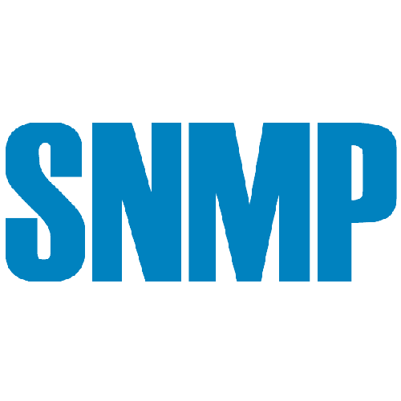

<!-- Insert App Logo -->
<p align="center">
  
</p>


<div align="center">

# Collect SNMP Data From Server And Network Devices

</div>

<p>  </p>


<p align="center">A simple GUI program buils by JavaFX to run as a SNMP manager on your computer</p>
<!-- Add some badges -->

<div align="center"> 

[](https://opensource.org/licenses/MIT)


</div>


 
<!-- Screenshot of the app -->
<p align="center">
  
</p>
Replace This Cat By Gif App Screenshot Demo later

<p> </P>

# Installation ⚒️

>Turn this section into a separate InstallGuide.md later : Please visit (hyperlink) our docs for the installation guide

**Using a ready-made build (Recommened)**

Download the lastest release that compatible with your OS from the releases page (Create later).

**Building yourself**

1. Clone the repository
```bash
git clone https://img.shields.io/badge/MoreBadgeLater-Something-blue
```
2. Install dependencies

***Rewrite this section later since our team change to Java instead of Python***

- For Debian/Ubuntu/Mint:

```bash
sudo apt install snmp snmp-mibs-downloader #for manager side
```
```bash
sudo apt install snmpd   #for agent side
```
- For other Linux Distro 
```bash
#I don't know :))
```
- For Windows

3. Configuration
4. Run it locally

# What's Included 📦

- Dashboard
- 
- Some function...


# Usage 🕹️


Choose the one that you feel best fits your project.

# Documentation 📜

Check out our report hyperLink


