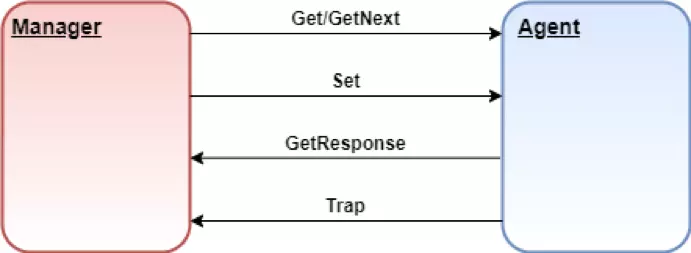

## What is SNMP

- SNMP stands for ***Simple Network Management Protocol***
- Developed to allow administrators to monitor network state and remotely modify setting, congiuration on network equiments like: switcher, routers, server, printers, uninteruptible power supplies things
-  Three version: 1, 2c, 3. Version 1,2c : no username, only require "community string" and no encryption support, version 3 require username and password, also support encryption


## Structure of  a SNMP device:

A devide that has SNMP is enable is called as an **agent** (EX: A router with SNMP enable). An agent can have many objects/sensors it can interact with. Some objects are part of an industry standard and some will be vendor-specific for this device. (In that case, information about these object should be found on vendors website)


For example, this agent has some objects like Name, uptime, interfaces, rounting table. Each object is assigned to an **OID** (OID is a sequence of number, look something similar to IP address, Ex: 1.3.6.1.2.1.2.2.1.8, use to indentify objects). These OID with their human-readable name is store in a text file **MIB**. (MIB stands for Management Information Base: a text file allow to translate numericlal OID to words, phrases human can understand)


The MIB follow a tree structure. For example, this is th MIB of sys object. Each level have number, this is where the numberiacl sequence in OID comes from


Refer: https://www.youtube.com/watch?v=2IXP0TkwNJU and https://www.youtube.com/watch?v=Lq7j-QipNrI


## Structure of  SNMP:
Refer: https://vietnix.vn/snmp-la-gi/

Các thành phần của SNMP

#### 1. SNMP Manager 

Network Management System (**NMS**): Trình quản lý hoặc hệ thống quản lý là một thực thể riêng biệt có trách nhiệm giao tiếp với các thiết bị mạng được triển khai SNMP agent. Đây thường là một máy tính được sử dụng để chạy một hoặc nhiều hệ thống quản lý mạng.

Các chức năng chính của SNMP manager:
- Agent truy vấn
- Nhận response từ các agent
- Đặt các biến trong agent
- Xác nhận các sự kiện không đồng bộ từ các agent

#### 2. Các thiết bị được SNMP quản lý

Thiết bị được quản lý hoặc phần tử mạng là một phần của mạng yêu cầu một số hình thức giám sát và quản lý, ví dụ: router, switches, server, máy trạm, máy in, UPS, v.v.

#### 3. SNMP Agent
Agent là một chương trình được đóng gói trong các thiết bị mạng. Việc kích hoạt agent cho phép nó thu thập cơ sở dữ liệu thông tin quản lý từ thiết bị cục bộ và cung cấp nó cho SNMP manager khi được truy vấn. Các agent này có thể là tiêu chuẩn (ví dụ: Net-SNMP) hoặc cụ thể cho một nhà cung cấp (ví dụ: HP insight agent).

Các chức năng chính của SNMP agent:

- Thu thập thông tin quản lý về các chỉ số hoạt động cuả thiết bị
- Lưu trữ và truy xuất thông tin quản lý như được định nghĩa trong MIB.
- Báo hiệu sự kiện cho trình quản lý.
- Hoạt động như một proxy cho một số nút mạng không quản lý được – SNMP.

## How SNMP works
NMS (A pice of software that can communicate with the SNMP agents). There are few ways the NMS can speak to the agent:


These command can be devide as follow:
-   Polling: when NMS actively requests information from the agent, then device respone info to the network monitor. All these actions happend on port 161 UDP
    - **Get** require: include Get, GetNext, GetBulk. 

        Để nhận thông tin trạng thái từ agent, manager có thể đưa ra message Get và GetNext để yêu cầu thông tin cho một biến cụ thể. Sau khi nhận được message Get hoặc GetNext, agent sẽ gửi message **GetResponse** cho manager. Nó sẽ chứa thông tin được yêu cầu hoặc lỗi giải thích tại sao không thể xử lý request.
    - **Set** require: Message SET cho phép manager yêu cầu thực hiện thay đổi đối giá trị của một object trong agent. Sau đó, agent sẽ trả lời bằng message Set-response nếu thay đổi đã được thực hiện hoặc lỗi giải thích tại sao không thể thực hiện thay đổi.


- Notifying: agents actively communication back to NMS event without request from NMS. These are useful for monitoring critical events, errors. All these action happend in port 162 UDP

    - **TRAP**: Message TRAP được khởi xướng bởi agent và gửi đến manager khi một sự kiện quan trọng xảy ra. Trap dùng để cảnh báo cho manager – thay vì đợi request trạng thái từ manager khi cần thăm dò ý kiến ​​của agent.
    - **INFORM**: Message INFORM rất giống với TRAP, nhưng chúng đáng tin cậy hơn. Các message INFORM được khởi tạo bởi agent và khi manager nhận được nó, nó sẽ gửi response đến agent cho biết message đã được nhận. Nếu agent không nhận được response từ manager thì agent sẽ gửi lại message INFORM.

        An Inform message will wait for acknowladgament from NMS, if it does not recieve one it will resend the Inform. A Trap is on the othterhand, send and then forgotten


- **SNMPWALK**: Nhận tất cả dữ liệu

    SNMPWALK sử dụng nhiều request Get-Next để truy xuất toàn bộ cây dữ liệu mạng từ một đối tượng được quản lý. Công cụ iReasoning MIB Browser sẽ rất hữu ích để xem tất cả các OID mà một agent cung cấp.


## Get IP address of connected router

Use:
```bash
ip route | grep default
#default via 192.168.1.1 dev wlp0s20f3 proto dhcp metric 600 
```
or 
```bash
route -n
```

## Test SNMP in Python
Refer: https://www.javatpoint.com/snmp-module-in-python
1. Download SNMP module for python:
```bash
pip install pysnmp  
```
2. Uderstand the Get operation

The Get operation of SNMP enables us to retrieve the value of an individual object in the MIB

```python
# importing the required module  
from pysnmp import hlapi  

# defining the get() function  
def get(target, oids, credentials, port = 161, engine = hlapi.SnmpEngine(), context = hlapi.ContextData()):  
    handler = hlapi.getCmd(  
        engine,  
        credentials,  
        hlapi.UdpTransportTarget((target, port)),  
        context,  
        *construct_object_types(oids)  
    )  
    return fetch(handler, 1)[0]  
```

#### Explain parameters
Function get() requires:
- **target** : Represents the IP address or hostname of the device from which you want to retrieve SNMP information

- **oids**: Represents the list of SNMP Object Identifiers (OIDs) that specify the information you want to retrieve.
- **credentials**: Represents the SNMP credentials (e.g. community string in SNMP version 1,2c or username/password in version 3) required to authenticate with the device.
- **port**: Represents the UDP port number (default is 161, the standard SNMP port).

- **engine**: Represents the SNMP engine used for communication (default is an instance of hlapi.SnmpEngine()).
    
    - *What this parameter "engine" use for? -> Represents the core component responsible for managing SNMP operations Like:*
        - Message Processing: Handles the encoding, decoding, and validation of SNMP messages.
        - Security Configuration: Manages SNMP security features like authentication and encryption settings.
        - Transport Layer Interaction: Communicates with transport protocols (e.g., UDP, TCP) for sending and receiving SNMP messages.
        - Session Management: Maintains the state and lifecycle of SNMP sessions and associated resources.

- **context**: (Phần này chưa hiểu lắm) The context parameter in SNMP, specifically hlapi.ContextData(), is used to define the context in which an SNMP operation is performed. In the context of the PySNMP high-level API (hlapi), ContextData() is an object that represents SNMP context information, which includes both the contextEngineId and the contextName. The contextName and contextEngineID parameters allow multiple versions of the same MIB objects to be made available by a single SNMPv3 engine, as if you have multiple agents running on the same IP address and port. These are distinguished from one another by contextName and contextEngineID, where otherwise they would have had a different address and/or port. 
Refer: https://stackoverflow.com/questions/32132365/significance-of-context-name-in-snmpv3

#### Explain the operation inside the function

- hlapi.getCmd: This function is used to create an SNMP GET command handler.
- engine: The SNMP engine object used for sending the command.
- credentials: The SNMP credentials object used for authentication.
- hlapi.UdpTransportTarget((target, port)): Creates a UDP transport target using the specified target (IP address or hostname) and port.
- context: The SNMP context data used for the operation.
- *construct_object_types(oids): This line calls a function construct_object_types() with oids as arguments to construct a list of SNMP Object Types for the SNMP GET operation.

- fetch(handler, 1): This part of the line calls a function named fetch() with two arguments:
    - handler: Represents the SNMP command handler generated by hlapi.getCmd(). This handler encapsulates the SNMP operation to retrieve information from a device.
    - 1: Indicates the maximum number of results to fetch. In this case, 1 means fetching only one result.
    
    After calling fetch(handler, 1), the [0] indexing is used to extract the first (and presumably only) result from the fetched data.
